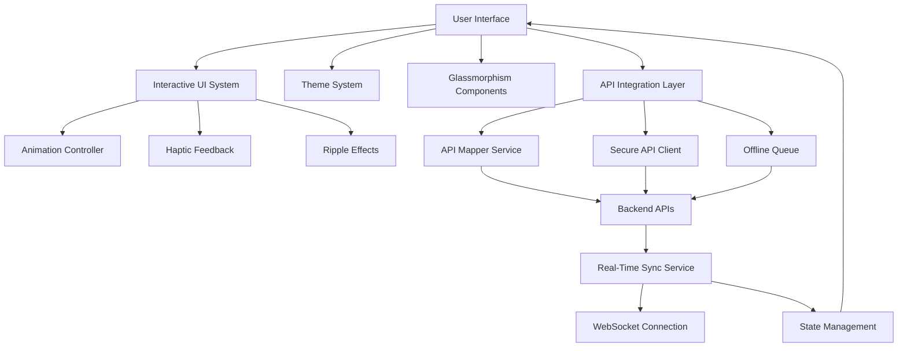

# Design Document: Complete Healthcare Platform Transformation

## Overview

This design document provides a comprehensive technical blueprint for transforming the healthcare platform ecosystem, including the User App, six Vendor Apps (Doctor, Nurse, Pharmacy, Pathology, Ambulance, Blood Bank), and Admin App. The transformation creates an interactive, futuristic interface with complete API integration, missing vendor features, bug fixes, and systematic progress tracking.

### Design Goals

1. **Interactive Experience**: Every UI element responds with smooth animations and visual feedback
2. **Modern Aesthetics**: Glassmorphism effects, gradients, and role-based themes create a premium feel
3. **Complete Integration**: All 151+ backend APIs properly mapped and connected to frontend screens
4. **Vendor Empowerment**: Specialized tools for availability management, prescription creation, and service delivery
5. **Reliability**: Robust error handling, offline capability, and real-time synchronization
6. **Performance**: 60fps animations, sub-2-second load times, and efficient resource usage
7. **Systematic Tracking**: Progress monitoring for screen upgrades and API integration

### Technology Stack

**Frontend:**
- Flutter 3.0+ (Dart)
- State Management: Provider / Riverpod
- Animations: Flutter AnimationController, Rive
- Real-time: WebSocket (socket_io_client)
- Local Storage: Hive / SharedPreferences
- HTTP Client: Dio with interceptors

**Backend:**
- Node.js with Express
- Database: MongoDB
- Real-time: Socket.IO
- Authentication: JWT
- File Storage: AWS S3 / CloudFlare R2

**Design System:**
- Material Design 3 principles
- Custom glassmorphism components
- Role-based color schemes
- Responsive layouts (320px - 1920px)

## Architecture

### System Architecture Overview

The platform follows a three-tier architecture with real-time synchronization:

```
┌─────────────────────────────────────────────────────────────┐
│                     Client Layer                             │
│  ┌──────────┐  ┌──────────┐  ┌──────────┐  ┌──────────┐   │
│  │ User App │  │ Vendor   │  │ Admin    │  │   PWA    │   │
│  │          │  │ Apps (6) │  │   App    │  │          │   │
│  └──────────┘  └──────────┘  └──────────┘  └──────────┘   │
└─────────────────────────────────────────────────────────────┘
                          ↕ HTTPS/WSS
┌─────────────────────────────────────────────────────────────┐
│                   API Gateway Layer                          │
│  ┌────────────────────────────────────────────────────┐     │
│  │  API Gateway (Load Balancer, Rate Limiting)       │     │
│  │  - Authentication Middleware                       │     │
│  │  - Request Validation                              │     │
│  │  - Response Transformation                         │     │
│  └────────────────────────────────────────────────────┘     │
└─────────────────────────────────────────────────────────────┘
                          ↕
┌─────────────────────────────────────────────────────────────┐
│                   Backend Services Layer                     │
│  ┌──────────┐  ┌──────────┐  ┌──────────┐  ┌──────────┐   │
│  │  User    │  │  Vendor  │  │  Booking │  │  Payment │   │
│  │ Service  │  │ Service  │  │ Service  │  │ Service  │   │
│  └──────────┘  └──────────┘  └──────────┘  └──────────┘   │
│  ┌──────────┐  ┌──────────┐  ┌──────────┐  ┌──────────┐   │
│  │  Notif.  │  │Real-Time │  │  Search  │  │  Admin   │   │
│  │ Service  │  │  Sync    │  │ Service  │  │ Service  │   │
│  └──────────┘  └──────────┘  └──────────┘  └──────────┘   │
└─────────────────────────────────────────────────────────────┘
                          ↕
┌─────────────────────────────────────────────────────────────┐
│                      Data Layer                              │
│  ┌──────────┐  ┌──────────┐  ┌──────────┐  ┌──────────┐   │
│  │ MongoDB  │  │  Redis   │  │   S3     │  │  Queue   │   │
│  │ Primary  │  │  Cache   │  │  Files   │  │ (RabbitMQ│   │
│  └──────────┘  └──────────┘  └──────────┘  └──────────┘   │
└─────────────────────────────────────────────────────────────┘
```

### Real-Time Synchronization Architecture

```
┌─────────────────────────────────────────────────────────────┐
│                  Real-Time Sync Flow                         │
│                                                              │
│  User App          WebSocket Server         Vendor App      │
│     │                    │                      │            │
│     │  1. Connect        │                      │            │
│     ├───────────────────>│                      │            │
│     │                    │                      │            │
│     │  2. Subscribe      │                      │            │
│     │  (user:123)        │                      │            │
│     ├───────────────────>│                      │            │
│     │                    │  3. Connect          │            │
│     │                    │<─────────────────────┤            │
│     │                    │                      │            │
│     │                    │  4. Subscribe        │            │
│     │                    │  (vendor:456)        │            │
│     │                    │<─────────────────────┤            │
│     │                    │                      │            │
│     │  5. Booking        │                      │            │
│     │  Created           │                      │            │
│     ├───────────────────>│                      │            │
│     │                    │  6. Emit Event       │            │
│     │                    │  (booking:new)       │            │
│     │                    ├─────────────────────>│            │
│     │                    │                      │            │
│     │  7. Confirmation   │                      │            │
│     │<───────────────────┤                      │            │
│     │                    │  8. Notification     │            │
│     │                    ├─────────────────────>│            │
└─────────────────────────────────────────────────────────────┘
```

### Component Interaction Flow



## Components and Interfaces

### 1. Interactive UI System

The Interactive UI System provides animations, transitions, and feedback for all user interactions.

#### 1.1 Animation Controller

**Purpose**: Centralized management of all animations with consistent timing and easing.

**Interface:**
```dart
class AnimationController {
  // Configuration
  static const Duration defaultDuration = Duration(milliseconds: 300);
  static const Duration hoverDuration = Duration(milliseconds: 150);
  static const Duration rippleDuration = Duration(milliseconds: 300);
  static const Curve defaultCurve = Curves.easeInOut;
  
  // Methods
  Future<void> animateHover(Widget widget, bool isHovered);
  Future<void> animatePress(Widget widget);
  Future<void> animateRipple(Offset position, Color color);
  Future<void> animateStaggeredEntrance(List<Widget> widgets);
  Future<void> animateSuccess();
  Future<void> animateError();
}
```

**Implementation Example:**
```dart
class InteractiveAnimationController {
  final TickerProvider vsync;
  
  late AnimationController _hoverController;
  late AnimationController _pressController;
  late AnimationController _rippleController;
  
  late Animation<double> _scaleAnimation;
  late Animation<double> _glowAnimation;
  late Animation<double> _rippleAnimation;
  
  InteractiveAnimationController({required this.vsync}) {
    _initializeControllers();
  }
  
  void _initializeControllers() {
    _hoverController = AnimationController(
      duration: const Duration(milliseconds: 150),
      vsync: vsync,
    );
    
    _pressController = AnimationController(
      duration: const Duration(milliseconds: 100),
      vsync: vsync,
    );
    
    _rippleController = AnimationController(
      duration: const Duration(milliseconds: 300),
      vsync: vsync,
    );
    
    _scaleAnimation = Tween<double>(begin: 1.0, end: 1.05).animate(
      CurvedAnimation(parent: _hoverController, curve: Curves.easeInOut),
    );
    
    _glowAnimation = Tween<double>(begin: 0.0, end: 8.0).animate(
      CurvedAnimation(parent: _hoverController, curve: Curves.easeInOut),
    );
    
    _rippleAnimation = Tween<double>(begin: 0.0, end: 1.0).animate(
      CurvedAnimation(parent: _rippleController, curve: Curves.easeOut),
    );
  }
  
  Future<void> animateHover(bool isHovered) async {
    if (isHovered) {
      await _hoverController.forward();
    } else {
      await _hoverController.reverse();
    }
  }
  
  Future<void> animatePress() async {
    await _pressController.forward();
    await _pressController.reverse();
    HapticFeedback.lightImpact();
  }
  
  Future<void> animateRipple() async {
    _rippleController.reset();
    await _rippleController.forward();
  }
  
  void dispose() {
    _hoverController.dispose();
    _pressController.dispose();
    _rippleController.dispose();
  }
}
```

#### 1.2 Interactive Button Component

**Purpose**: Button with hover effects, glow, ripple, and haptic feedback.

**Implementation:**
```dart
class InteractiveButton extends StatefulWidget {
  final String text;
  final VoidCallback onPressed;
  final Color? backgroundColor;
  final Color? textColor;
  final IconData? icon;
  final bool isLoading;
  final bool isDisabled;
  
  const InteractiveButton({
    Key? key,
    required this.text,
    required this.onPressed,
    this.backgroundColor,
    this.textColor,
    this.icon,
    this.isLoading = false,
    this.isDisabled = false,
  }) : super(key: key);
  
  @override
  State<InteractiveButton> createState() => _InteractiveButtonState();
}

class _InteractiveButtonState extends State<InteractiveButton>
    with SingleTickerProviderStateMixin {
  late InteractiveAnimationController _animationController;
  bool _isHovered = false;
  bool _isPressed = false;
  
  @override
  void initState() {
    super.initState();
    _animationController = InteractiveAnimationController(vsync: this);
  }
  
  @override
  Widget build(BuildContext context) {
    final theme = Theme.of(context);
    final bgColor = widget.backgroundColor ?? theme.primaryColor;
    final textColor = widget.textColor ?? Colors.white;
    
    return MouseRegion(
      onEnter: (_) => _handleHover(true),
      onExit: (_) => _handleHover(false),
      child: GestureDetector(
        onTapDown: (_) => _handlePress(true),
        onTapUp: (_) => _handlePress(false),
        onTapCancel: () => _handlePress(false),
        onTap: widget.isDisabled || widget.isLoading ? null : widget.onPressed,
        child: AnimatedBuilder(
          animation: _animationController._hoverController,
          builder: (context, child) {
            return Transform.scale(
              scale: _animationController._scaleAnimation.value,
              child: Container(
                padding: const EdgeInsets.symmetric(
                  horizontal: 24,
                  vertical: 16,
                ),
                decoration: BoxDecoration(
                  gradient: LinearGradient(
                    colors: [
                      bgColor,
                      bgColor.withOpacity(0.8),
                    ],
                  ),
                  borderRadius: BorderRadius.circular(12),
                  boxShadow: [
                    BoxShadow(
                      color: bgColor.withOpacity(0.3),
                      blurRadius: _animationController._glowAnimation.value,
                      spreadRadius: _animationController._glowAnimation.value / 2,
                    ),
                  ],
                ),
                child: Row(
                  mainAxisSize: MainAxisSize.min,
                  children: [
                    if (widget.icon != null) ...[
                      Icon(widget.icon, color: textColor, size: 20),
                      const SizedBox(width: 8),
                    ],
                    if (widget.isLoading)
                      SizedBox(
                        width: 20,
                        height: 20,
                        child: CircularProgressIndicator(
                          strokeWidth: 2,
                          valueColor: AlwaysStoppedAnimation(textColor),
                        ),
                      )
                    else
                      Text(
                        widget.text,
                        style: TextStyle(
                          color: textColor,
                          fontSize: 16,
                          fontWeight: FontWeight.w600,
                        ),
                      ),
                  ],
                ),
              ),
            );
          },
        ),
      ),
    );
  }
  
  void _handleHover(bool isHovered) {
    if (widget.isDisabled || widget.isLoading) return;
    setState(() => _isHovered = isHovered);
    _animationController.animateHover(isHovered);
  }
  
  void _handlePress(bool isPressed) {
    if (widget.isDisabled || widget.isLoading) return;
    setState(() => _isPressed = isPressed);
    if (isPressed) {
      _animationController.animatePress();
      _animationController.animateRipple();
    }
  }
  
  @override
  void dispose() {
    _animationController.dispose();
    super.dispose();
  }
}
```

#### 1.3 Interactive Card Component

**Purpose**: Card with elevation changes, hover effects, and tap animations.

**Implementation:**
```dart
class InteractiveCard extends StatefulWidget {
  final Widget child;
  final VoidCallback? onTap;
  final EdgeInsets? padding;
  final double? width;
  final double? height;
  
  const InteractiveCard({
    Key? key,
    required this.child,
    this.onTap,
    this.padding,
    this.width,
    this.height,
  }) : super(key: key);
  
  @override
  State<InteractiveCard> createState() => _InteractiveCardState();
}

class _InteractiveCardState extends State<InteractiveCard>
    with SingleTickerProviderStateMixin {
  late AnimationController _controller;
  late Animation<double> _scaleAnimation;
  late Animation<double> _elevationAnimation;
  
  bool _isHovered = false;
  
  @override
  void initState() {
    super.initState();
    _controller = AnimationController(
      duration: const Duration(milliseconds: 150),
      vsync: this,
    );
    
    _scaleAnimation = Tween<double>(begin: 1.0, end: 1.02).animate(
      CurvedAnimation(parent: _controller, curve: Curves.easeInOut),
    );
    
    _elevationAnimation = Tween<double>(begin: 2.0, end: 8.0).animate(
      CurvedAnimation(parent: _controller, curve: Curves.easeInOut),
    );
  }
  
  @override
  Widget build(BuildContext context) {
    return MouseRegion(
      onEnter: (_) => _handleHover(true),
      onExit: (_) => _handleHover(false),
      child: GestureDetector(
        onTap: widget.onTap,
        child: AnimatedBuilder(
          animation: _controller,
          builder: (context, child) {
            return Transform.scale(
              scale: _scaleAnimation.value,
              child: Container(
                width: widget.width,
                height: widget.height,
                padding: widget.padding ?? const EdgeInsets.all(16),
                decoration: BoxDecoration(
                  color: Colors.white,
                  borderRadius: BorderRadius.circular(16),
                  boxShadow: [
                    BoxShadow(
                      color: Colors.black.withOpacity(0.1),
                      blurRadius: _elevationAnimation.value,
                      offset: Offset(0, _elevationAnimation.value / 2),
                    ),
                  ],
                ),
                child: widget.child,
              ),
            );
          },
        ),
      ),
    );
  }
  
  void _handleHover(bool isHovered) {
    setState(() => _isHovered = isHovered);
    if (isHovered) {
      _controller.forward();
    } else {
      _controller.reverse();
    }
  }
  
  @override
  void dispose() {
    _controller.dispose();
    super.dispose();
  }
}
```

#### 1.4 Ripple Effect System

**Purpose**: Material-style ripple effect for tap feedback.

**Implementation:**
```dart
class RippleEffect extends StatefulWidget {
  final Widget child;
  final VoidCallback? onTap;
  final Color? rippleColor;
  
  const RippleEffect({
    Key? key,
    required this.child,
    this.onTap,
    this.rippleColor,
  }) : super(key: key);
  
  @override
  State<RippleEffect> createState() => _RippleEffectState();
}

class _RippleEffectState extends State<RippleEffect>
    with SingleTickerProviderStateMixin {
  late AnimationController _controller;
  late Animation<double> _animation;
  Offset? _tapPosition;
  
  @override
  void initState() {
    super.initState();
    _controller = AnimationController(
      duration: const Duration(milliseconds: 300),
      vsync: this,
    );
    
    _animation = Tween<double>(begin: 0.0, end: 1.0).animate(
      CurvedAnimation(parent: _controller, curve: Curves.easeOut),
    );
  }
  
  @override
  Widget build(BuildContext context) {
    return GestureDetector(
      onTapDown: (details) {
        setState(() => _tapPosition = details.localPosition);
        _controller.forward(from: 0.0);
        HapticFeedback.lightImpact();
      },
      onTap: widget.onTap,
      child: CustomPaint(
        painter: _RipplePainter(
          animation: _animation,
          tapPosition: _tapPosition,
          color: widget.rippleColor ?? Theme.of(context).primaryColor.withOpacity(0.3),
        ),
        child: widget.child,
      ),
    );
  }
  
  @override
  void dispose() {
    _controller.dispose();
    super.dispose();
  }
}

class _RipplePainter extends CustomPainter {
  final Animation<double> animation;
  final Offset? tapPosition;
  final Color color;
  
  _RipplePainter({
    required this.animation,
    required this.tapPosition,
    required this.color,
  }) : super(repaint: animation);
  
  @override
  void paint(Canvas canvas, Size size) {
    if (tapPosition == null) return;
    
    final paint = Paint()
      ..color = color.withOpacity((1.0 - animation.value) * 0.3)
      ..style = PaintingStyle.fill;
    
    final maxRadius = size.longestSide;
    final radius = maxRadius * animation.value;
    
    canvas.drawCircle(tapPosition!, radius, paint);
  }
  
  @override
  bool shouldRepaint(_RipplePainter oldDelegate) {
    return oldDelegate.animation != animation ||
        oldDelegate.tapPosition != tapPosition;
  }
}
```

#### 1.5 Staggered Animation System

**Purpose**: Animate list items with staggered timing for visual appeal.

**Implementation:**
```dart
class StaggeredAnimationList extends StatelessWidget {
  final List<Widget> children;
  final Duration staggerDelay;
  final Axis direction;
  
  const StaggeredAnimationList({
    Key? key,
    required this.children,
    this.staggerDelay = const Duration(milliseconds: 50),
    this.direction = Axis.vertical,
  }) : super(key: key);
  
  @override
  Widget build(BuildContext context) {
    return direction == Axis.vertical
        ? Column(
            children: _buildStaggeredChildren(),
          )
        : Row(
            children: _buildStaggeredChildren(),
          );
  }
  
  List<Widget> _buildStaggeredChildren() {
    return List.generate(children.length, (index) {
      return StaggeredAnimationItem(
        delay: staggerDelay * index,
        child: children[index],
      );
    });
  }
}

class StaggeredAnimationItem extends StatefulWidget {
  final Widget child;
  final Duration delay;
  
  const StaggeredAnimationItem({
    Key? key,
    required this.child,
    required this.delay,
  }) : super(key: key);
  
  @override
  State<StaggeredAnimationItem> createState() => _StaggeredAnimationItemState();
}

class _StaggeredAnimationItemState extends State<StaggeredAnimationItem>
    with SingleTickerProviderStateMixin {
  late AnimationController _controller;
  late Animation<double> _fadeAnimation;
  late Animation<Offset> _slideAnimation;
  
  @override
  void initState() {
    super.initState();
    _controller = AnimationController(
      duration: const Duration(milliseconds: 400),
      vsync: this,
    );
    
    _fadeAnimation = Tween<double>(begin: 0.0, end: 1.0).animate(
      CurvedAnimation(parent: _controller, curve: Curves.easeIn),
    );
    
    _slideAnimation = Tween<Offset>(
      begin: const Offset(0, 0.2),
      end: Offset.zero,
    ).animate(
      CurvedAnimation(parent: _controller, curve: Curves.easeOut),
    );
    
    Future.delayed(widget.delay, () {
      if (mounted) _controller.forward();
    });
  }
  
  @override
  Widget build(BuildContext context) {
    return FadeTransition(
      opacity: _fadeAnimation,
      child: SlideTransition(
        position: _slideAnimation,
        child: widget.child,
      ),
    );
  }
  
  @override
  void dispose() {
    _controller.dispose();
    super.dispose();
  }
}
```

### 2. Glassmorphism Design System

The Glassmorphism Design System provides modern glass-like UI components with blur and transparency.

#### 2.1 GlassContainer Widget

**Purpose**: Base container with glassmorphism effect.

**Implementation:**
```dart
class GlassContainer extends StatelessWidget {
  final Widget child;
  final double? width;
  final double? height;
  final EdgeInsets? padding;
  final EdgeInsets? margin;
  final double borderRadius;
  final double blurAmount;
  final double opacity;
  final Color? backgroundColor;
  final Border? border;
  
  const GlassContainer({
    Key? key,
    required this.child,
    this.width,
    this.height,
    this.padding,
    this.margin,
    this.borderRadius = 16.0,
    this.blurAmount = 10.0,
    this.opacity = 0.8,
    this.backgroundColor,
    this.border,
  }) : super(key: key);
  
  @override
  Widget build(BuildContext context) {
    final bgColor = backgroundColor ?? Colors.white.withOpacity(opacity);
    
    return Container(
      width: width,
      height: height,
      margin: margin,
      child: ClipRRect(
        borderRadius: BorderRadius.circular(borderRadius),
        child: BackdropFilter(
          filter: ImageFilter.blur(
            sigmaX: blurAmount,
            sigmaY: blurAmount,
          ),
          child: Container(
            padding: padding ?? const EdgeInsets.all(16),
            decoration: BoxDecoration(
              color: bgColor,
              borderRadius: BorderRadius.circular(borderRadius),
              border: border ??
                  Border.all(
                    color: Colors.white.withOpacity(0.2),
                    width: 1,
                  ),
            ),
            child: child,
          ),
        ),
      ),
    );
  }
}
```


#### 2.2 FloatingPanel Widget

**Purpose**: Elevated panel with glass effect and shadow.

**Implementation:**
```dart
class FloatingPanel extends StatelessWidget {
  final Widget child;
  final double elevation;
  final EdgeInsets? padding;
  
  const FloatingPanel({
    Key? key,
    required this.child,
    this.elevation = 8.0,
    this.padding,
  }) : super(key: key);
  
  @override
  Widget build(BuildContext context) {
    return GlassContainer(
      padding: padding,
      child: Container(
        decoration: BoxDecoration(
          boxShadow: [
            BoxShadow(
              color: Colors.black.withOpacity(0.1),
              blurRadius: elevation * 2,
              offset: Offset(0, elevation),
            ),
          ],
        ),
        child: child,
      ),
    );
  }
}
```

#### 2.3 GlassCard Widget

**Purpose**: Card component with glassmorphism for content display.

**Implementation:**
```dart
class GlassCard extends StatelessWidget {
  final Widget child;
  final VoidCallback? onTap;
  final double? width;
  final double? height;
  
  const GlassCard({
    Key? key,
    required this.child,
    this.onTap,
    this.width,
    this.height,
  }) : super(key: key);
  
  @override
  Widget build(BuildContext context) {
    return InteractiveCard(
      onTap: onTap,
      width: width,
      height: height,
      child: GlassContainer(
        padding: const EdgeInsets.all(16),
        child: child,
      ),
    );
  }
}
```

#### 2.4 GlassBottomSheet Widget

**Purpose**: Bottom sheet with glassmorphism for modals.

**Implementation:**
```dart
class GlassBottomSheet extends StatelessWidget {
  final Widget child;
  final double? height;
  
  const GlassBottomSheet({
    Key? key,
    required this.child,
    this.height,
  }) : super(key: key);
  
  static Future<T?> show<T>({
    required BuildContext context,
    required Widget child,
    double? height,
  }) {
    return showModalBottomSheet<T>(
      context: context,
      backgroundColor: Colors.transparent,
      builder: (context) => GlassBottomSheet(
        child: child,
        height: height,
      ),
    );
  }
  
  @override
  Widget build(BuildContext context) {
    return Container(
      height: height,
      decoration: BoxDecoration(
        borderRadius: const BorderRadius.vertical(top: Radius.circular(24)),
      ),
      child: GlassContainer(
        borderRadius: 24,
        blurAmount: 15,
        opacity: 0.9,
        child: child,
      ),
    );
  }
}
```


### 3. Theme System Architecture

The Theme System provides role-based color schemes and dynamic theme switching.

#### 3.1 ThemeConfiguration Model

**Purpose**: Data model for theme configuration.

**Implementation:**
```dart
class ThemeConfiguration {
  final String id;
  final String name;
  final UserRole role;
  final List<Color> gradientColors;
  final Color primaryColor;
  final Color secondaryColor;
  final Color accentColor;
  final Color backgroundColor;
  final Color textColor;
  final Color errorColor;
  final Color successColor;
  final bool isDarkMode;
  
  const ThemeConfiguration({
    required this.id,
    required this.name,
    required this.role,
    required this.gradientColors,
    required this.primaryColor,
    required this.secondaryColor,
    required this.accentColor,
    required this.backgroundColor,
    required this.textColor,
    required this.errorColor,
    required this.successColor,
    this.isDarkMode = false,
  });
  
  // Generate hover state color (10% lighter)
  Color get hoverColor => _lightenColor(primaryColor, 0.1);
  
  // Generate active state color (10% darker)
  Color get activeColor => _darkenColor(primaryColor, 0.1);
  
  // Generate disabled state color (40% opacity)
  Color get disabledColor => primaryColor.withOpacity(0.4);
  
  Color _lightenColor(Color color, double amount) {
    final hsl = HSLColor.fromColor(color);
    return hsl.withLightness((hsl.lightness + amount).clamp(0.0, 1.0)).toColor();
  }
  
  Color _darkenColor(Color color, double amount) {
    final hsl = HSLColor.fromColor(color);
    return hsl.withLightness((hsl.lightness - amount).clamp(0.0, 1.0)).toColor();
  }
}

enum UserRole {
  patient,
  doctor,
  nurse,
  pharmacy,
  pathology,
  ambulance,
  bloodBank,
  admin,
}
```


#### 3.2 ThemeManager Service

**Purpose**: Manages theme loading, switching, and persistence.

**Implementation:**
```dart
class ThemeManager extends ChangeNotifier {
  ThemeConfiguration _currentTheme;
  final SharedPreferences _prefs;
  
  ThemeManager({
    required SharedPreferences prefs,
    required UserRole initialRole,
  })  : _prefs = prefs,
        _currentTheme = _getThemeForRole(initialRole) {
    _loadSavedTheme();
  }
  
  ThemeConfiguration get currentTheme => _currentTheme;
  
  static final Map<UserRole, ThemeConfiguration> _themes = {
    UserRole.patient: ThemeConfiguration(
      id: 'patient',
      name: 'Wellness Purple',
      role: UserRole.patient,
      gradientColors: [Color(0xFF667EEA), Color(0xFF764BA2)],
      primaryColor: Color(0xFF667EEA),
      secondaryColor: Color(0xFF764BA2),
      accentColor: Color(0xFF9F7AEA),
      backgroundColor: Color(0xFFF7FAFC),
      textColor: Color(0xFF2D3748),
      errorColor: Color(0xFFE53E3E),
      successColor: Color(0xFF38A169),
    ),
    UserRole.doctor: ThemeConfiguration(
      id: 'doctor',
      name: 'Medical Blue',
      role: UserRole.doctor,
      gradientColors: [Color(0xFF2196F3), Color(0xFF1976D2)],
      primaryColor: Color(0xFF2196F3),
      secondaryColor: Color(0xFF1976D2),
      accentColor: Color(0xFF42A5F5),
      backgroundColor: Color(0xFFF7FAFC),
      textColor: Color(0xFF2D3748),
      errorColor: Color(0xFFE53E3E),
      successColor: Color(0xFF38A169),
    ),
    // ... other roles
  };
  
  static ThemeConfiguration _getThemeForRole(UserRole role) {
    return _themes[role] ?? _themes[UserRole.patient]!;
  }
  
  Future<void> switchTheme(UserRole role) async {
    _currentTheme = _getThemeForRole(role);
    await _prefs.setString('theme_role', role.toString());
    notifyListeners();
  }
  
  Future<void> toggleDarkMode() async {
    // Implementation for dark mode toggle
    notifyListeners();
  }
  
  Future<void> _loadSavedTheme() async {
    final savedRole = _prefs.getString('theme_role');
    if (savedRole != null) {
      final role = UserRole.values.firstWhere(
        (r) => r.toString() == savedRole,
        orElse: () => UserRole.patient,
      );
      _currentTheme = _getThemeForRole(role);
      notifyListeners();
    }
  }
}
```


### 4. API Integration Architecture

The API Integration layer manages all communication with backend services.

#### 4.1 APIMapper Service

**Purpose**: Tracks and manages screen-to-API mappings with monitoring.

**Data Model:**
```dart
class APIEndpoint {
  final String id;
  final String path;
  final String method;
  final String service;
  final String description;
  final List<String> requiredParams;
  final Map<String, dynamic> responseSchema;
  
  const APIEndpoint({
    required this.id,
    required this.path,
    required this.method,
    required this.service,
    required this.description,
    required this.requiredParams,
    required this.responseSchema,
  });
}

class ScreenAPIMapping {
  final String screenId;
  final String screenName;
  final List<String> apiEndpointIds;
  final bool isFullyIntegrated;
  final DateTime lastUpdated;
  
  const ScreenAPIMapping({
    required this.screenId,
    required this.screenName,
    required this.apiEndpointIds,
    required this.isFullyIntegrated,
    required this.lastUpdated,
  });
}

class APICallLog {
  final String id;
  final String endpointId;
  final String screenId;
  final DateTime timestamp;
  final int statusCode;
  final Duration responseTime;
  final bool isSuccess;
  final String? errorMessage;
  
  const APICallLog({
    required this.id,
    required this.endpointId,
    required this.screenId,
    required this.timestamp,
    required this.statusCode,
    required this.responseTime,
    required this.isSuccess,
    this.errorMessage,
  });
}
```


**Service Implementation:**
```dart
class APIMapperService {
  final Map<String, APIEndpoint> _endpoints = {};
  final Map<String, ScreenAPIMapping> _screenMappings = {};
  final List<APICallLog> _callLogs = [];
  
  // Initialize with all API endpoints
  void registerEndpoint(APIEndpoint endpoint) {
    _endpoints[endpoint.id] = endpoint;
  }
  
  // Register screen-to-API mapping
  void registerScreenMapping(ScreenAPIMapping mapping) {
    _screenMappings[mapping.screenId] = mapping;
  }
  
  // Log API call
  void logAPICall(APICallLog log) {
    _callLogs.add(log);
    _pruneOldLogs();
  }
  
  // Get mapping status report
  MappingStatusReport getMappingStatus() {
    final totalEndpoints = _endpoints.length;
    final mappedEndpoints = _screenMappings.values
        .expand((m) => m.apiEndpointIds)
        .toSet()
        .length;
    
    final totalScreens = _screenMappings.length;
    final fullyIntegratedScreens = _screenMappings.values
        .where((m) => m.isFullyIntegrated)
        .length;
    
    return MappingStatusReport(
      totalEndpoints: totalEndpoints,
      mappedEndpoints: mappedEndpoints,
      unmappedEndpoints: totalEndpoints - mappedEndpoints,
      totalScreens: totalScreens,
      fullyIntegratedScreens: fullyIntegratedScreens,
      partiallyIntegratedScreens: totalScreens - fullyIntegratedScreens,
      integrationPercentage: (mappedEndpoints / totalEndpoints * 100).round(),
    );
  }
  
  // Get unmapped APIs
  List<APIEndpoint> getUnmappedAPIs() {
    final mappedIds = _screenMappings.values
        .expand((m) => m.apiEndpointIds)
        .toSet();
    
    return _endpoints.values
        .where((e) => !mappedIds.contains(e.id))
        .toList();
  }
  
  // Get screens without API integration
  List<ScreenAPIMapping> getUnintegratedScreens() {
    return _screenMappings.values
        .where((m) => !m.isFullyIntegrated)
        .toList();
  }
  
  void _pruneOldLogs() {
    final cutoff = DateTime.now().subtract(const Duration(days: 7));
    _callLogs.removeWhere((log) => log.timestamp.isBefore(cutoff));
  }
}
```


#### 4.2 Secure API Client

**Purpose**: HTTP client with error handling, retry logic, and circuit breaker.

**Implementation:**
```dart
class SecureAPIClient {
  final Dio _dio;
  final APIMapperService _mapper;
  final CircuitBreaker _circuitBreaker;
  final OfflineQueue _offlineQueue;
  
  SecureAPIClient({
    required String baseUrl,
    required APIMapperService mapper,
  })  : _dio = Dio(BaseOptions(baseUrl: baseUrl)),
        _mapper = mapper,
        _circuitBreaker = CircuitBreaker(),
        _offlineQueue = OfflineQueue() {
    _setupInterceptors();
  }
  
  void _setupInterceptors() {
    _dio.interceptors.add(
      InterceptorsWrapper(
        onRequest: (options, handler) async {
          // Add auth token
          final token = await _getAuthToken();
          if (token != null) {
            options.headers['Authorization'] = 'Bearer $token';
          }
          
          // Add request ID for tracking
          options.headers['X-Request-ID'] = Uuid().v4();
          
          return handler.next(options);
        },
        onResponse: (response, handler) {
          // Log successful call
          _logAPICall(response, isSuccess: true);
          return handler.next(response);
        },
        onError: (error, handler) async {
          // Log failed call
          _logAPICall(error.response, isSuccess: false, error: error);
          
          // Handle specific error codes
          if (error.response?.statusCode == 401) {
            await _handleUnauthorized();
          }
          
          return handler.next(error);
        },
      ),
    );
  }
  
  Future<Response<T>> get<T>(
    String path, {
    Map<String, dynamic>? queryParameters,
    String? screenId,
    int maxRetries = 3,
  }) async {
    return _executeWithRetry(
      () => _dio.get<T>(path, queryParameters: queryParameters),
      screenId: screenId,
      maxRetries: maxRetries,
    );
  }
  
  Future<Response<T>> post<T>(
    String path, {
    dynamic data,
    String? screenId,
    int maxRetries = 3,
  }) async {
    return _executeWithRetry(
      () => _dio.post<T>(path, data: data),
      screenId: screenId,
      maxRetries: maxRetries,
    );
  }
  
  Future<Response<T>> _executeWithRetry<T>(
    Future<Response<T>> Function() request, {
    String? screenId,
    int maxRetries = 3,
  }) async {
    // Check circuit breaker
    if (_circuitBreaker.isOpen) {
      throw CircuitBreakerOpenException();
    }
    
    int attempts = 0;
    Duration delay = const Duration(seconds: 1);
    
    while (attempts < maxRetries) {
      try {
        final stopwatch = Stopwatch()..start();
        final response = await request();
        stopwatch.stop();
        
        _circuitBreaker.recordSuccess();
        return response;
      } catch (e) {
        attempts++;
        _circuitBreaker.recordFailure();
        
        if (attempts >= maxRetries) {
          // Queue for offline retry if network error
          if (e is DioException && e.type == DioExceptionType.connectionError) {
            _offlineQueue.enqueue(request);
          }
          rethrow;
        }
        
        // Exponential backoff
        await Future.delayed(delay);
        delay *= 2;
      }
    }
    
    throw Exception('Max retries exceeded');
  }
  
  void _logAPICall(Response? response, {required bool isSuccess, DioException? error}) {
    // Implementation
  }
  
  Future<String?> _getAuthToken() async {
    // Implementation
    return null;
  }
  
  Future<void> _handleUnauthorized() async {
    // Trigger re-authentication
  }
}
```


#### 4.3 Circuit Breaker Pattern

**Purpose**: Prevent cascading failures by stopping requests to failing services.

**Implementation:**
```dart
class CircuitBreaker {
  int _failureCount = 0;
  DateTime? _lastFailureTime;
  CircuitBreakerState _state = CircuitBreakerState.closed;
  
  static const int failureThreshold = 5;
  static const Duration timeout = Duration(seconds: 30);
  
  bool get isOpen => _state == CircuitBreakerState.open;
  bool get isHalfOpen => _state == CircuitBreakerState.halfOpen;
  bool get isClosed => _state == CircuitBreakerState.closed;
  
  void recordSuccess() {
    _failureCount = 0;
    _state = CircuitBreakerState.closed;
  }
  
  void recordFailure() {
    _failureCount++;
    _lastFailureTime = DateTime.now();
    
    if (_failureCount >= failureThreshold) {
      _state = CircuitBreakerState.open;
    }
  }
  
  void attemptReset() {
    if (_state == CircuitBreakerState.open) {
      final timeSinceLastFailure = DateTime.now().difference(_lastFailureTime!);
      if (timeSinceLastFailure >= timeout) {
        _state = CircuitBreakerState.halfOpen;
        _failureCount = 0;
      }
    }
  }
}

enum CircuitBreakerState {
  closed,  // Normal operation
  open,    // Blocking requests
  halfOpen // Testing if service recovered
}
```

#### 4.4 Offline Queue Management

**Purpose**: Queue requests when offline and sync when connection restored.

**Implementation:**
```dart
class OfflineQueue {
  final List<QueuedRequest> _queue = [];
  final Connectivity _connectivity = Connectivity();
  
  void enqueue(Future<Response> Function() request) {
    _queue.add(QueuedRequest(
      id: Uuid().v4(),
      request: request,
      timestamp: DateTime.now(),
    ));
  }
  
  Future<void> processQueue() async {
    if (_queue.isEmpty) return;
    
    final connectivityResult = await _connectivity.checkConnectivity();
    if (connectivityResult == ConnectivityResult.none) return;
    
    final requests = List<QueuedRequest>.from(_queue);
    _queue.clear();
    
    for (final queuedRequest in requests) {
      try {
        await queuedRequest.request();
      } catch (e) {
        // Re-queue if still failing
        _queue.add(queuedRequest);
      }
    }
  }
  
  void clear() {
    _queue.clear();
  }
}

class QueuedRequest {
  final String id;
  final Future<Response> Function() request;
  final DateTime timestamp;
  
  const QueuedRequest({
    required this.id,
    required this.request,
    required this.timestamp,
  });
}
```


#### 4.5 Real-Time Sync Service

**Purpose**: WebSocket-based real-time data synchronization.

**Implementation:**
```dart
class RealTimeSyncService {
  late IO.Socket _socket;
  final String _baseUrl;
  final Map<String, List<Function(dynamic)>> _listeners = {};
  bool _isConnected = false;
  
  RealTimeSyncService({required String baseUrl}) : _baseUrl = baseUrl;
  
  Future<void> connect(String userId, String userType) async {
    _socket = IO.io(_baseUrl, <String, dynamic>{
      'transports': ['websocket'],
      'autoConnect': false,
      'auth': {
        'userId': userId,
        'userType': userType,
      },
    });
    
    _socket.on('connect', (_) {
      _isConnected = true;
      print('WebSocket connected');
    });
    
    _socket.on('disconnect', (_) {
      _isConnected = false;
      print('WebSocket disconnected');
      _attemptReconnect();
    });
    
    _socket.on('error', (error) {
      print('WebSocket error: $error');
    });
    
    // Listen for specific events
    _socket.on('booking:new', (data) => _notifyListeners('booking:new', data));
    _socket.on('booking:updated', (data) => _notifyListeners('booking:updated', data));
    _socket.on('availability:changed', (data) => _notifyListeners('availability:changed', data));
    _socket.on('prescription:new', (data) => _notifyListeners('prescription:new', data));
    _socket.on('message:new', (data) => _notifyListeners('message:new', data));
    
    _socket.connect();
  }
  
  void subscribe(String event, Function(dynamic) callback) {
    if (!_listeners.containsKey(event)) {
      _listeners[event] = [];
    }
    _listeners[event]!.add(callback);
  }
  
  void unsubscribe(String event, Function(dynamic) callback) {
    _listeners[event]?.remove(callback);
  }
  
  void emit(String event, dynamic data) {
    if (_isConnected) {
      _socket.emit(event, data);
    }
  }
  
  void _notifyListeners(String event, dynamic data) {
    _listeners[event]?.forEach((callback) => callback(data));
  }
  
  void _attemptReconnect() {
    Future.delayed(const Duration(seconds: 5), () {
      if (!_isConnected) {
        _socket.connect();
      }
    });
  }
  
  void disconnect() {
    _socket.disconnect();
    _listeners.clear();
  }
}
```


### 5. Screen Upgrade Tracking System

The Upgrade Tracker monitors transformation progress across all apps.

#### 5.1 UpgradeTracker Service

**Data Models:**
```dart
class ScreenRegistry {
  final String id;
  final String name;
  final String appType; // user, vendor, admin
  final String category; // home, booking, profile, etc.
  final UpgradeStatus status;
  final bool hasInteractiveUI;
  final bool hasAPIIntegration;
  final bool hasGlassmorphism;
  final bool hasTheming;
  final DateTime lastUpdated;
  
  const ScreenRegistry({
    required this.id,
    required this.name,
    required this.appType,
    required this.category,
    required this.status,
    required this.hasInteractiveUI,
    required this.hasAPIIntegration,
    required this.hasGlassmorphism,
    required this.hasTheming,
    required this.lastUpdated,
  });
  
  bool get isFullyUpgraded =>
      hasInteractiveUI && hasAPIIntegration && hasGlassmorphism && hasTheming;
}

enum UpgradeStatus {
  notStarted,
  inProgress,
  completed,
}

class ProgressReport {
  final int totalScreens;
  final int completedScreens;
  final int inProgressScreens;
  final int notStartedScreens;
  final double completionPercentage;
  final Map<String, int> byApp;
  final Map<String, int> byCategory;
  
  const ProgressReport({
    required this.totalScreens,
    required this.completedScreens,
    required this.inProgressScreens,
    required this.notStartedScreens,
    required this.completionPercentage,
    required this.byApp,
    required this.byCategory,
  });
}
```


**Service Implementation:**
```dart
class UpgradeTrackerService {
  final Map<String, ScreenRegistry> _screens = {};
  
  void registerScreen(ScreenRegistry screen) {
    _screens[screen.id] = screen;
  }
  
  void updateScreenStatus(String screenId, {
    UpgradeStatus? status,
    bool? hasInteractiveUI,
    bool? hasAPIIntegration,
    bool? hasGlassmorphism,
    bool? hasTheming,
  }) {
    final screen = _screens[screenId];
    if (screen == null) return;
    
    _screens[screenId] = ScreenRegistry(
      id: screen.id,
      name: screen.name,
      appType: screen.appType,
      category: screen.category,
      status: status ?? screen.status,
      hasInteractiveUI: hasInteractiveUI ?? screen.hasInteractiveUI,
      hasAPIIntegration: hasAPIIntegration ?? screen.hasAPIIntegration,
      hasGlassmorphism: hasGlassmorphism ?? screen.hasGlassmorphism,
      hasTheming: hasTheming ?? screen.hasTheming,
      lastUpdated: DateTime.now(),
    );
  }
  
  ProgressReport generateProgressReport() {
    final screens = _screens.values.toList();
    
    final completed = screens.where((s) => s.status == UpgradeStatus.completed).length;
    final inProgress = screens.where((s) => s.status == UpgradeStatus.inProgress).length;
    final notStarted = screens.where((s) => s.status == UpgradeStatus.notStarted).length;
    
    final byApp = <String, int>{};
    final byCategory = <String, int>{};
    
    for (final screen in screens) {
      if (screen.status == UpgradeStatus.completed) {
        byApp[screen.appType] = (byApp[screen.appType] ?? 0) + 1;
        byCategory[screen.category] = (byCategory[screen.category] ?? 0) + 1;
      }
    }
    
    return ProgressReport(
      totalScreens: screens.length,
      completedScreens: completed,
      inProgressScreens: inProgress,
      notStartedScreens: notStarted,
      completionPercentage: (completed / screens.length * 100),
      byApp: byApp,
      byCategory: byCategory,
    );
  }
  
  List<ScreenRegistry> getPartiallyUpgradedScreens() {
    return _screens.values
        .where((s) => !s.isFullyUpgraded && s.status != UpgradeStatus.notStarted)
        .toList();
  }
  
  Map<String, dynamic> exportToJSON() {
    return {
      'screens': _screens.values.map((s) => {
        'id': s.id,
        'name': s.name,
        'appType': s.appType,
        'category': s.category,
        'status': s.status.toString(),
        'hasInteractiveUI': s.hasInteractiveUI,
        'hasAPIIntegration': s.hasAPIIntegration,
        'hasGlassmorphism': s.hasGlassmorphism,
        'hasTheming': s.hasTheming,
        'lastUpdated': s.lastUpdated.toIso8601String(),
      }).toList(),
      'report': generateProgressReport(),
    };
  }
}
```


### 6. Vendor Feature Designs

#### 6.1 Availability Management System

**Purpose**: Allow vendors to manage their working hours and availability.

**Data Models:**
```dart
class AvailabilitySchedule {
  final String vendorId;
  final Map<DayOfWeek, List<TimeSlot>> weeklySchedule;
  final List<DateOverride> dateOverrides;
  final int maxAppointmentsPerDay;
  final Duration breakDuration;
  final bool isAvailableNow;
  
  const AvailabilitySchedule({
    required this.vendorId,
    required this.weeklySchedule,
    required this.dateOverrides,
    required this.maxAppointmentsPerDay,
    required this.breakDuration,
    required this.isAvailableNow,
  });
}

class TimeSlot {
  final TimeOfDay startTime;
  final TimeOfDay endTime;
  final bool isAvailable;
  final int? bookedAppointmentId;
  
  const TimeSlot({
    required this.startTime,
    required this.endTime,
    required this.isAvailable,
    this.bookedAppointmentId,
  });
}

class DateOverride {
  final DateTime date;
  final bool isAvailable;
  final String? reason;
  
  const DateOverride({
    required this.date,
    required this.isAvailable,
    this.reason,
  });
}

enum DayOfWeek {
  monday, tuesday, wednesday, thursday, friday, saturday, sunday
}
```


**UI Components:**
```dart
class AvailabilityCalendarWidget extends StatefulWidget {
  final AvailabilitySchedule schedule;
  final Function(DateTime, bool) onDateToggle;
  
  const AvailabilityCalendarWidget({
    Key? key,
    required this.schedule,
    required this.onDateToggle,
  }) : super(key: key);
  
  @override
  State<AvailabilityCalendarWidget> createState() => _AvailabilityCalendarWidgetState();
}

class _AvailabilityCalendarWidgetState extends State<AvailabilityCalendarWidget> {
  DateTime _selectedMonth = DateTime.now();
  
  @override
  Widget build(BuildContext context) {
    return GlassCard(
      child: Column(
        children: [
          _buildMonthHeader(),
          _buildCalendarGrid(),
          _buildLegend(),
        ],
      ),
    );
  }
  
  Widget _buildMonthHeader() {
    return Row(
      mainAxisAlignment: MainAxisAlignment.spaceBetween,
      children: [
        InteractiveButton(
          text: 'Previous',
          icon: Icons.chevron_left,
          onPressed: () {
            setState(() {
              _selectedMonth = DateTime(
                _selectedMonth.year,
                _selectedMonth.month - 1,
              );
            });
          },
        ),
        Text(
          DateFormat('MMMM yyyy').format(_selectedMonth),
          style: const TextStyle(
            fontSize: 20,
            fontWeight: FontWeight.bold,
          ),
        ),
        InteractiveButton(
          text: 'Next',
          icon: Icons.chevron_right,
          onPressed: () {
            setState(() {
              _selectedMonth = DateTime(
                _selectedMonth.year,
                _selectedMonth.month + 1,
              );
            });
          },
        ),
      ],
    );
  }
  
  Widget _buildCalendarGrid() {
    // Implementation for calendar grid with availability indicators
    return GridView.builder(
      shrinkWrap: true,
      physics: const NeverScrollableScrollPhysics(),
      gridDelegate: const SliverGridDelegateWithFixedCrossAxisCount(
        crossAxisCount: 7,
        childAspectRatio: 1,
      ),
      itemCount: 35,
      itemBuilder: (context, index) {
        final date = _getDateForIndex(index);
        final isAvailable = _isDateAvailable(date);
        
        return InteractiveCard(
          onTap: () => widget.onDateToggle(date, !isAvailable),
          child: Container(
            decoration: BoxDecoration(
              color: isAvailable ? Colors.green.withOpacity(0.2) : Colors.red.withOpacity(0.2),
              borderRadius: BorderRadius.circular(8),
            ),
            child: Center(
              child: Text(
                date.day.toString(),
                style: TextStyle(
                  fontWeight: FontWeight.w600,
                  color: isAvailable ? Colors.green : Colors.red,
                ),
              ),
            ),
          ),
        );
      },
    );
  }
  
  DateTime _getDateForIndex(int index) {
    // Implementation
    return DateTime.now();
  }
  
  bool _isDateAvailable(DateTime date) {
    // Check schedule and overrides
    return true;
  }
  
  Widget _buildLegend() {
    return Row(
      mainAxisAlignment: MainAxisAlignment.center,
      children: [
        _buildLegendItem(Colors.green, 'Available'),
        const SizedBox(width: 16),
        _buildLegendItem(Colors.red, 'Unavailable'),
        const SizedBox(width: 16),
        _buildLegendItem(Colors.blue, 'Booked'),
      ],
    );
  }
  
  Widget _buildLegendItem(Color color, String label) {
    return Row(
      children: [
        Container(
          width: 16,
          height: 16,
          decoration: BoxDecoration(
            color: color.withOpacity(0.3),
            borderRadius: BorderRadius.circular(4),
          ),
        ),
        const SizedBox(width: 4),
        Text(label),
      ],
    );
  }
}
```


**Time Slot Selector:**
```dart
class TimeSlotSelectorWidget extends StatelessWidget {
  final List<TimeSlot> timeSlots;
  final Function(TimeSlot) onSlotToggle;
  
  const TimeSlotSelectorWidget({
    Key? key,
    required this.timeSlots,
    required this.onSlotToggle,
  }) : super(key: key);
  
  @override
  Widget build(BuildContext context) {
    return GlassCard(
      child: Column(
        crossAxisAlignment: CrossAxisAlignment.start,
        children: [
          const Text(
            'Time Slots',
            style: TextStyle(
              fontSize: 18,
              fontWeight: FontWeight.bold,
            ),
          ),
          const SizedBox(height: 16),
          Wrap(
            spacing: 8,
            runSpacing: 8,
            children: timeSlots.map((slot) => _buildTimeSlotChip(slot)).toList(),
          ),
        ],
      ),
    );
  }
  
  Widget _buildTimeSlotChip(TimeSlot slot) {
    return InteractiveButton(
      text: '${_formatTime(slot.startTime)} - ${_formatTime(slot.endTime)}',
      backgroundColor: slot.isAvailable ? Colors.green : Colors.grey,
      onPressed: () => onSlotToggle(slot),
    );
  }
  
  String _formatTime(TimeOfDay time) {
    final hour = time.hour.toString().padLeft(2, '0');
    final minute = time.minute.toString().padLeft(2, '0');
    return '$hour:$minute';
  }
}
```

**Service Implementation:**
```dart
class AvailabilityManagerService {
  final SecureAPIClient _apiClient;
  final RealTimeSyncService _syncService;
  
  AvailabilityManagerService({
    required SecureAPIClient apiClient,
    required RealTimeSyncService syncService,
  })  : _apiClient = apiClient,
        _syncService = syncService;
  
  Future<AvailabilitySchedule> getSchedule(String vendorId) async {
    final response = await _apiClient.get(
      '/vendors/$vendorId/availability',
      screenId: 'availability_management',
    );
    
    return AvailabilitySchedule.fromJson(response.data);
  }
  
  Future<void> updateDateAvailability(
    String vendorId,
    DateTime date,
    bool isAvailable,
  ) async {
    await _apiClient.post(
      '/vendors/$vendorId/availability/date',
      data: {
        'date': date.toIso8601String(),
        'isAvailable': isAvailable,
      },
      screenId: 'availability_management',
    );
    
    // Emit real-time update
    _syncService.emit('availability:changed', {
      'vendorId': vendorId,
      'date': date.toIso8601String(),
      'isAvailable': isAvailable,
    });
  }
  
  Future<void> updateTimeSlot(
    String vendorId,
    DayOfWeek day,
    TimeSlot slot,
  ) async {
    await _apiClient.post(
      '/vendors/$vendorId/availability/timeslot',
      data: {
        'day': day.toString(),
        'startTime': '${slot.startTime.hour}:${slot.startTime.minute}',
        'endTime': '${slot.endTime.hour}:${slot.endTime.minute}',
        'isAvailable': slot.isAvailable,
      },
      screenId: 'availability_management',
    );
  }
  
  Future<void> toggleAvailableNow(String vendorId, bool isAvailable) async {
    await _apiClient.post(
      '/vendors/$vendorId/availability/now',
      data: {'isAvailable': isAvailable},
      screenId: 'availability_management',
    );
    
    _syncService.emit('availability:now', {
      'vendorId': vendorId,
      'isAvailable': isAvailable,
    });
  }
}
```


#### 6.2 Prescription Creation System

**Purpose**: Enable doctors to create prescriptions with medicine search and dosage instructions.

**Data Models:**
```dart
class Prescription {
  final String id;
  final String patientId;
  final String patientName;
  final String doctorId;
  final String doctorName;
  final String doctorLicense;
  final DateTime date;
  final List<Medicine> medicines;
  final String? generalNotes;
  final String? diagnosis;
  
  const Prescription({
    required this.id,
    required this.patientId,
    required this.patientName,
    required this.doctorId,
    required this.doctorName,
    required this.doctorLicense,
    required this.date,
    required this.medicines,
    this.generalNotes,
    this.diagnosis,
  });
  
  Map<String, dynamic> toJson() => {
    'id': id,
    'patientId': patientId,
    'patientName': patientName,
    'doctorId': doctorId,
    'doctorName': doctorName,
    'doctorLicense': doctorLicense,
    'date': date.toIso8601String(),
    'medicines': medicines.map((m) => m.toJson()).toList(),
    'generalNotes': generalNotes,
    'diagnosis': diagnosis,
  };
  
  factory Prescription.fromJson(Map<String, dynamic> json) {
    return Prescription(
      id: json['id'],
      patientId: json['patientId'],
      patientName: json['patientName'],
      doctorId: json['doctorId'],
      doctorName: json['doctorName'],
      doctorLicense: json['doctorLicense'],
      date: DateTime.parse(json['date']),
      medicines: (json['medicines'] as List)
          .map((m) => Medicine.fromJson(m))
          .toList(),
      generalNotes: json['generalNotes'],
      diagnosis: json['diagnosis'],
    );
  }
}

class Medicine {
  final String name;
  final String? genericName;
  final String? brand;
  final String strength;
  final String form; // tablet, capsule, syrup, etc.
  final Dosage dosage;
  final Duration duration;
  final String? specialInstructions;
  
  const Medicine({
    required this.name,
    this.genericName,
    this.brand,
    required this.strength,
    required this.form,
    required this.dosage,
    required this.duration,
    this.specialInstructions,
  });
  
  Map<String, dynamic> toJson() => {
    'name': name,
    'genericName': genericName,
    'brand': brand,
    'strength': strength,
    'form': form,
    'dosage': dosage.toJson(),
    'duration': duration.inDays,
    'specialInstructions': specialInstructions,
  };
  
  factory Medicine.fromJson(Map<String, dynamic> json) {
    return Medicine(
      name: json['name'],
      genericName: json['genericName'],
      brand: json['brand'],
      strength: json['strength'],
      form: json['form'],
      dosage: Dosage.fromJson(json['dosage']),
      duration: Duration(days: json['duration']),
      specialInstructions: json['specialInstructions'],
    );
  }
}

class Dosage {
  final int morning;
  final int afternoon;
  final int evening;
  final String timing; // before_food, after_food, with_food
  
  const Dosage({
    required this.morning,
    required this.afternoon,
    required this.evening,
    required this.timing,
  });
  
  String get displayText => '$morning-$afternoon-$evening';
  
  Map<String, dynamic> toJson() => {
    'morning': morning,
    'afternoon': afternoon,
    'evening': evening,
    'timing': timing,
  };
  
  factory Dosage.fromJson(Map<String, dynamic> json) {
    return Dosage(
      morning: json['morning'],
      afternoon: json['afternoon'],
      evening: json['evening'],
      timing: json['timing'],
    );
  }
}
```


**UI Components:**
```dart
class PrescriptionCreatorWidget extends StatefulWidget {
  final String patientId;
  final String patientName;
  final Function(Prescription) onSave;
  
  const PrescriptionCreatorWidget({
    Key? key,
    required this.patientId,
    required this.patientName,
    required this.onSave,
  }) : super(key: key);
  
  @override
  State<PrescriptionCreatorWidget> createState() => _PrescriptionCreatorWidgetState();
}

class _PrescriptionCreatorWidgetState extends State<PrescriptionCreatorWidget> {
  final List<Medicine> _medicines = [];
  final TextEditingController _diagnosisController = TextEditingController();
  final TextEditingController _notesController = TextEditingController();
  
  @override
  Widget build(BuildContext context) {
    return GlassContainer(
      child: Column(
        crossAxisAlignment: CrossAxisAlignment.start,
        children: [
          _buildHeader(),
          const SizedBox(height: 24),
          _buildDiagnosisField(),
          const SizedBox(height: 16),
          _buildMedicinesList(),
          const SizedBox(height: 16),
          _buildAddMedicineButton(),
          const SizedBox(height: 16),
          _buildNotesField(),
          const SizedBox(height: 24),
          _buildActionButtons(),
        ],
      ),
    );
  }
  
  Widget _buildHeader() {
    return Column(
      crossAxisAlignment: CrossAxisAlignment.start,
      children: [
        const Text(
          'Create Prescription',
          style: TextStyle(fontSize: 24, fontWeight: FontWeight.bold),
        ),
        const SizedBox(height: 8),
        Text(
          'Patient: ${widget.patientName}',
          style: const TextStyle(fontSize: 16, color: Colors.grey),
        ),
      ],
    );
  }
  
  Widget _buildDiagnosisField() {
    return TextField(
      controller: _diagnosisController,
      decoration: const InputDecoration(
        labelText: 'Diagnosis',
        border: OutlineInputBorder(),
      ),
      maxLines: 2,
    );
  }
  
  Widget _buildMedicinesList() {
    return Column(
      crossAxisAlignment: CrossAxisAlignment.start,
      children: [
        const Text(
          'Medicines',
          style: TextStyle(fontSize: 18, fontWeight: FontWeight.bold),
        ),
        const SizedBox(height: 8),
        ..._medicines.map((medicine) => _buildMedicineCard(medicine)).toList(),
      ],
    );
  }
  
  Widget _buildMedicineCard(Medicine medicine) {
    return GlassCard(
      child: Column(
        crossAxisAlignment: CrossAxisAlignment.start,
        children: [
          Row(
            mainAxisAlignment: MainAxisAlignment.spaceBetween,
            children: [
              Expanded(
                child: Text(
                  medicine.name,
                  style: const TextStyle(
                    fontSize: 16,
                    fontWeight: FontWeight.bold,
                  ),
                ),
              ),
              IconButton(
                icon: const Icon(Icons.delete, color: Colors.red),
                onPressed: () {
                  setState(() => _medicines.remove(medicine));
                },
              ),
            ],
          ),
          const SizedBox(height: 8),
          Text('Strength: ${medicine.strength}'),
          Text('Dosage: ${medicine.dosage.displayText}'),
          Text('Duration: ${medicine.duration.inDays} days'),
          if (medicine.specialInstructions != null)
            Text('Instructions: ${medicine.specialInstructions}'),
        ],
      ),
    );
  }
  
  Widget _buildAddMedicineButton() {
    return InteractiveButton(
      text: 'Add Medicine',
      icon: Icons.add,
      onPressed: () => _showMedicineSearchDialog(),
    );
  }
  
  Widget _buildNotesField() {
    return TextField(
      controller: _notesController,
      decoration: const InputDecoration(
        labelText: 'General Notes',
        border: OutlineInputBorder(),
      ),
      maxLines: 3,
    );
  }
  
  Widget _buildActionButtons() {
    return Row(
      children: [
        Expanded(
          child: InteractiveButton(
            text: 'Preview',
            onPressed: () => _showPreview(),
          ),
        ),
        const SizedBox(width: 16),
        Expanded(
          child: InteractiveButton(
            text: 'Save Prescription',
            onPressed: () => _savePrescription(),
          ),
        ),
      ],
    );
  }
  
  void _showMedicineSearchDialog() {
    showDialog(
      context: context,
      builder: (context) => MedicineSearchDialog(
        onMedicineSelected: (medicine) {
          setState(() => _medicines.add(medicine));
        },
      ),
    );
  }
  
  void _showPreview() {
    // Show prescription preview
  }
  
  void _savePrescription() {
    final prescription = Prescription(
      id: Uuid().v4(),
      patientId: widget.patientId,
      patientName: widget.patientName,
      doctorId: 'current_doctor_id',
      doctorName: 'Dr. Name',
      doctorLicense: 'LICENSE123',
      date: DateTime.now(),
      medicines: _medicines,
      generalNotes: _notesController.text,
      diagnosis: _diagnosisController.text,
    );
    
    widget.onSave(prescription);
  }
}
```


**Medicine Search Dialog:**
```dart
class MedicineSearchDialog extends StatefulWidget {
  final Function(Medicine) onMedicineSelected;
  
  const MedicineSearchDialog({
    Key? key,
    required this.onMedicineSelected,
  }) : super(key: key);
  
  @override
  State<MedicineSearchDialog> createState() => _MedicineSearchDialogState();
}

class _MedicineSearchDialogState extends State<MedicineSearchDialog> {
  final TextEditingController _searchController = TextEditingController();
  List<MedicineInfo> _searchResults = [];
  Medicine? _selectedMedicine;
  
  @override
  Widget build(BuildContext context) {
    return Dialog(
      child: GlassContainer(
        width: 600,
        height: 700,
        child: Column(
          children: [
            _buildSearchField(),
            const SizedBox(height: 16),
            Expanded(child: _buildSearchResults()),
            if (_selectedMedicine != null) ...[
              const Divider(),
              _buildDosageBuilder(),
              const SizedBox(height: 16),
              _buildAddButton(),
            ],
          ],
        ),
      ),
    );
  }
  
  Widget _buildSearchField() {
    return TextField(
      controller: _searchController,
      decoration: const InputDecoration(
        labelText: 'Search Medicine',
        prefixIcon: Icon(Icons.search),
        border: OutlineInputBorder(),
      ),
      onChanged: (value) => _performSearch(value),
    );
  }
  
  Widget _buildSearchResults() {
    return ListView.builder(
      itemCount: _searchResults.length,
      itemBuilder: (context, index) {
        final medicine = _searchResults[index];
        return InteractiveCard(
          onTap: () => _selectMedicine(medicine),
          child: ListTile(
            title: Text(medicine.name),
            subtitle: Text('${medicine.genericName} - ${medicine.strength}'),
            trailing: Text(medicine.form),
          ),
        );
      },
    );
  }
  
  Widget _buildDosageBuilder() {
    // Dosage selection UI
    return Container();
  }
  
  Widget _buildAddButton() {
    return InteractiveButton(
      text: 'Add Medicine',
      onPressed: () {
        if (_selectedMedicine != null) {
          widget.onMedicineSelected(_selectedMedicine!);
          Navigator.pop(context);
        }
      },
    );
  }
  
  void _performSearch(String query) async {
    // Debounced search implementation
  }
  
  void _selectMedicine(MedicineInfo info) {
    setState(() {
      // Create Medicine object from MedicineInfo
    });
  }
}
```


#### 6.3 Patient History Viewing System

**Purpose**: Display comprehensive patient history for informed care.

**Data Models:**
```dart
class PatientHistory {
  final String patientId;
  final List<ConsultationRecord> consultations;
  final List<Prescription> prescriptions;
  final List<Appointment> appointments;
  final List<VitalSigns> vitals;
  final List<LabResult> labResults;
  
  const PatientHistory({
    required this.patientId,
    required this.consultations,
    required this.prescriptions,
    required this.appointments,
    required this.vitals,
    required this.labResults,
  });
}

class ConsultationRecord {
  final String id;
  final DateTime date;
  final String doctorName;
  final String symptoms;
  final String diagnosis;
  final String treatment;
  final String notes;
  
  const ConsultationRecord({
    required this.id,
    required this.date,
    required this.doctorName,
    required this.symptoms,
    required this.diagnosis,
    required this.treatment,
    required this.notes,
  });
}

class VitalSigns {
  final DateTime recordedAt;
  final double? bloodPressureSystolic;
  final double? bloodPressureDiastolic;
  final double? temperature;
  final int? heartRate;
  final int? oxygenSaturation;
  final double? weight;
  final double? height;
  
  const VitalSigns({
    required this.recordedAt,
    this.bloodPressureSystolic,
    this.bloodPressureDiastolic,
    this.temperature,
    this.heartRate,
    this.oxygenSaturation,
    this.weight,
    this.height,
  });
}
```

**UI Component:**
```dart
class PatientHistoryWidget extends StatefulWidget {
  final String patientId;
  
  const PatientHistoryWidget({
    Key? key,
    required this.patientId,
  }) : super(key: key);
  
  @override
  State<PatientHistoryWidget> createState() => _PatientHistoryWidgetState();
}

class _PatientHistoryWidgetState extends State<PatientHistoryWidget> {
  PatientHistory? _history;
  String _selectedFilter = 'all';
  DateTimeRange? _dateRange;
  
  @override
  Widget build(BuildContext context) {
    return Column(
      children: [
        _buildFilters(),
        const SizedBox(height: 16),
        Expanded(child: _buildTimeline()),
      ],
    );
  }
  
  Widget _buildFilters() {
    return Row(
      children: [
        Expanded(
          child: DropdownButton<String>(
            value: _selectedFilter,
            items: const [
              DropdownMenuItem(value: 'all', child: Text('All')),
              DropdownMenuItem(value: 'consultations', child: Text('Consultations')),
              DropdownMenuItem(value: 'prescriptions', child: Text('Prescriptions')),
              DropdownMenuItem(value: 'vitals', child: Text('Vitals')),
              DropdownMenuItem(value: 'labs', child: Text('Lab Results')),
            ],
            onChanged: (value) {
              setState(() => _selectedFilter = value!);
            },
          ),
        ),
        const SizedBox(width: 16),
        InteractiveButton(
          text: 'Date Range',
          icon: Icons.calendar_today,
          onPressed: () => _selectDateRange(),
        ),
      ],
    );
  }
  
  Widget _buildTimeline() {
    if (_history == null) {
      return const Center(child: CircularProgressIndicator());
    }
    
    final items = _getFilteredItems();
    
    return ListView.builder(
      itemCount: items.length,
      itemBuilder: (context, index) {
        return _buildTimelineItem(items[index]);
      },
    );
  }
  
  Widget _buildTimelineItem(dynamic item) {
    return GlassCard(
      child: Row(
        crossAxisAlignment: CrossAxisAlignment.start,
        children: [
          _buildTimelineDot(),
          const SizedBox(width: 16),
          Expanded(child: _buildItemContent(item)),
        ],
      ),
    );
  }
  
  Widget _buildTimelineDot() {
    return Container(
      width: 12,
      height: 12,
      decoration: BoxDecoration(
        color: Theme.of(context).primaryColor,
        shape: BoxShape.circle,
      ),
    );
  }
  
  Widget _buildItemContent(dynamic item) {
    if (item is ConsultationRecord) {
      return _buildConsultationCard(item);
    } else if (item is Prescription) {
      return _buildPrescriptionCard(item);
    } else if (item is VitalSigns) {
      return _buildVitalsCard(item);
    }
    return Container();
  }
  
  Widget _buildConsultationCard(ConsultationRecord consultation) {
    return Column(
      crossAxisAlignment: CrossAxisAlignment.start,
      children: [
        Text(
          'Consultation',
          style: const TextStyle(
            fontSize: 16,
            fontWeight: FontWeight.bold,
          ),
        ),
        const SizedBox(height: 8),
        Text('Date: ${DateFormat('MMM dd, yyyy').format(consultation.date)}'),
        Text('Doctor: ${consultation.doctorName}'),
        Text('Diagnosis: ${consultation.diagnosis}'),
        const SizedBox(height: 8),
        InteractiveButton(
          text: 'View Details',
          onPressed: () => _showConsultationDetails(consultation),
        ),
      ],
    );
  }
  
  Widget _buildPrescriptionCard(Prescription prescription) {
    return Column(
      crossAxisAlignment: CrossAxisAlignment.start,
      children: [
        Text(
          'Prescription',
          style: const TextStyle(
            fontSize: 16,
            fontWeight: FontWeight.bold,
          ),
        ),
        const SizedBox(height: 8),
        Text('Date: ${DateFormat('MMM dd, yyyy').format(prescription.date)}'),
        Text('Medicines: ${prescription.medicines.length}'),
        const SizedBox(height: 8),
        InteractiveButton(
          text: 'View Prescription',
          onPressed: () => _showPrescriptionDetails(prescription),
        ),
      ],
    );
  }
  
  Widget _buildVitalsCard(VitalSigns vitals) {
    return Column(
      crossAxisAlignment: CrossAxisAlignment.start,
      children: [
        Text(
          'Vital Signs',
          style: const TextStyle(
            fontSize: 16,
            fontWeight: FontWeight.bold,
          ),
        ),
        const SizedBox(height: 8),
        if (vitals.bloodPressureSystolic != null)
          Text('BP: ${vitals.bloodPressureSystolic}/${vitals.bloodPressureDiastolic}'),
        if (vitals.heartRate != null)
          Text('Heart Rate: ${vitals.heartRate} bpm'),
        if (vitals.temperature != null)
          Text('Temperature: ${vitals.temperature}°F'),
      ],
    );
  }
  
  List<dynamic> _getFilteredItems() {
    // Filter and sort items based on selected filter and date range
    return [];
  }
  
  void _selectDateRange() async {
    // Show date range picker
  }
  
  void _showConsultationDetails(ConsultationRecord consultation) {
    // Show full consultation details
  }
  
  void _showPrescriptionDetails(Prescription prescription) {
    // Show full prescription details
  }
}
```


#### 6.4 Contextual Help System

**Purpose**: Provide in-app help and tutorials for complex features.

**Data Models:**
```dart
class HelpContent {
  final String id;
  final String title;
  final String description;
  final String category;
  final List<String> keywords;
  final String? videoUrl;
  final List<HelpStep>? steps;
  
  const HelpContent({
    required this.id,
    required this.title,
    required this.description,
    required this.category,
    required this.keywords,
    this.videoUrl,
    this.steps,
  });
}

class HelpStep {
  final String title;
  final String description;
  final String? imageUrl;
  
  const HelpStep({
    required this.title,
    required this.description,
    this.imageUrl,
  });
}

class TutorialOverlay {
  final String screenId;
  final List<TutorialStep> steps;
  final bool showOnFirstVisit;
  
  const TutorialOverlay({
    required this.screenId,
    required this.steps,
    required this.showOnFirstVisit,
  });
}

class TutorialStep {
  final String targetWidgetKey;
  final String title;
  final String description;
  final Offset tooltipPosition;
  
  const TutorialStep({
    required this.targetWidgetKey,
    required this.title,
    required this.description,
    required this.tooltipPosition,
  });
}
```

**UI Components:**
```dart
class HelpButton extends StatelessWidget {
  final String screenId;
  final String? specificTopic;
  
  const HelpButton({
    Key? key,
    required this.screenId,
    this.specificTopic,
  }) : super(key: key);
  
  @override
  Widget build(BuildContext context) {
    return IconButton(
      icon: const Icon(Icons.help_outline),
      onPressed: () => _showHelp(context),
    );
  }
  
  void _showHelp(BuildContext context) {
    showModalBottomSheet(
      context: context,
      builder: (context) => HelpBottomSheet(
        screenId: screenId,
        specificTopic: specificTopic,
      ),
    );
  }
}

class HelpBottomSheet extends StatefulWidget {
  final String screenId;
  final String? specificTopic;
  
  const HelpBottomSheet({
    Key? key,
    required this.screenId,
    this.specificTopic,
  }) : super(key: key);
  
  @override
  State<HelpBottomSheet> createState() => _HelpBottomSheetState();
}

class _HelpBottomSheetState extends State<HelpBottomSheet> {
  final TextEditingController _searchController = TextEditingController();
  List<HelpContent> _helpItems = [];
  
  @override
  Widget build(BuildContext context) {
    return GlassBottomSheet(
      height: MediaQuery.of(context).size.height * 0.7,
      child: Column(
        children: [
          _buildHeader(),
          const SizedBox(height: 16),
          _buildSearchField(),
          const SizedBox(height: 16),
          Expanded(child: _buildHelpList()),
          _buildContactSupport(),
        ],
      ),
    );
  }
  
  Widget _buildHeader() {
    return Row(
      mainAxisAlignment: MainAxisAlignment.spaceBetween,
      children: [
        const Text(
          'Help & Support',
          style: TextStyle(
            fontSize: 20,
            fontWeight: FontWeight.bold,
          ),
        ),
        IconButton(
          icon: const Icon(Icons.close),
          onPressed: () => Navigator.pop(context),
        ),
      ],
    );
  }
  
  Widget _buildSearchField() {
    return TextField(
      controller: _searchController,
      decoration: const InputDecoration(
        labelText: 'Search help topics',
        prefixIcon: Icon(Icons.search),
        border: OutlineInputBorder(),
      ),
      onChanged: (value) => _performSearch(value),
    );
  }
  
  Widget _buildHelpList() {
    return ListView.builder(
      itemCount: _helpItems.length,
      itemBuilder: (context, index) {
        final item = _helpItems[index];
        return InteractiveCard(
          onTap: () => _showHelpDetails(item),
          child: ListTile(
            leading: const Icon(Icons.article),
            title: Text(item.title),
            subtitle: Text(item.description),
            trailing: const Icon(Icons.chevron_right),
          ),
        );
      },
    );
  }
  
  Widget _buildContactSupport() {
    return InteractiveButton(
      text: 'Contact Support',
      icon: Icons.support_agent,
      onPressed: () => _contactSupport(),
    );
  }
  
  void _performSearch(String query) {
    // Search help content
  }
  
  void _showHelpDetails(HelpContent content) {
    Navigator.push(
      context,
      MaterialPageRoute(
        builder: (context) => HelpDetailScreen(content: content),
      ),
    );
  }
  
  void _contactSupport() {
    // Open support contact with pre-filled context
  }
}
```


**Tutorial Overlay System:**
```dart
class TutorialOverlayWidget extends StatefulWidget {
  final TutorialOverlay tutorial;
  final Widget child;
  
  const TutorialOverlayWidget({
    Key? key,
    required this.tutorial,
    required this.child,
  }) : super(key: key);
  
  @override
  State<TutorialOverlayWidget> createState() => _TutorialOverlayWidgetState();
}

class _TutorialOverlayWidgetState extends State<TutorialOverlayWidget> {
  int _currentStep = 0;
  bool _showTutorial = false;
  
  @override
  void initState() {
    super.initState();
    _checkShouldShowTutorial();
  }
  
  @override
  Widget build(BuildContext context) {
    return Stack(
      children: [
        widget.child,
        if (_showTutorial) _buildTutorialOverlay(),
      ],
    );
  }
  
  Widget _buildTutorialOverlay() {
    final step = widget.tutorial.steps[_currentStep];
    
    return Container(
      color: Colors.black.withOpacity(0.7),
      child: Stack(
        children: [
          _buildSpotlight(step),
          _buildTooltip(step),
          _buildNavigationButtons(),
        ],
      ),
    );
  }
  
  Widget _buildSpotlight(TutorialStep step) {
    // Highlight the target widget
    return Container();
  }
  
  Widget _buildTooltip(TutorialStep step) {
    return Positioned(
      left: step.tooltipPosition.dx,
      top: step.tooltipPosition.dy,
      child: GlassContainer(
        width: 300,
        child: Column(
          crossAxisAlignment: CrossAxisAlignment.start,
          children: [
            Text(
              step.title,
              style: const TextStyle(
                fontSize: 18,
                fontWeight: FontWeight.bold,
              ),
            ),
            const SizedBox(height: 8),
            Text(step.description),
          ],
        ),
      ),
    );
  }
  
  Widget _buildNavigationButtons() {
    return Positioned(
      bottom: 32,
      left: 0,
      right: 0,
      child: Row(
        mainAxisAlignment: MainAxisAlignment.center,
        children: [
          if (_currentStep > 0)
            InteractiveButton(
              text: 'Previous',
              onPressed: () {
                setState(() => _currentStep--);
              },
            ),
          const SizedBox(width: 16),
          InteractiveButton(
            text: _currentStep < widget.tutorial.steps.length - 1 ? 'Next' : 'Done',
            onPressed: () {
              if (_currentStep < widget.tutorial.steps.length - 1) {
                setState(() => _currentStep++);
              } else {
                _completeTutorial();
              }
            },
          ),
          const SizedBox(width: 16),
          TextButton(
            onPressed: () => _skipTutorial(),
            child: const Text('Skip'),
          ),
        ],
      ),
    );
  }
  
  void _checkShouldShowTutorial() async {
    final prefs = await SharedPreferences.getInstance();
    final hasSeenTutorial = prefs.getBool('tutorial_${widget.tutorial.screenId}') ?? false;
    
    if (!hasSeenTutorial && widget.tutorial.showOnFirstVisit) {
      setState(() => _showTutorial = true);
    }
  }
  
  void _completeTutorial() async {
    final prefs = await SharedPreferences.getInstance();
    await prefs.setBool('tutorial_${widget.tutorial.screenId}', true);
    setState(() => _showTutorial = false);
  }
  
  void _skipTutorial() async {
    final prefs = await SharedPreferences.getInstance();
    await prefs.setBool('tutorial_${widget.tutorial.screenId}', true);
    setState(() => _showTutorial = false);
  }
}
```


### 7. Bug Fix Designs

#### 7.1 Location Detection Fix

**Problem**: Location shows "null null" instead of proper address.

**Solution Architecture:**
```dart
class LocationService {
  final Geolocator _geolocator = Geolocator();
  final Geocoding _geocoding = Geocoding();
  Location? _cachedLocation;
  
  Future<Location> getCurrentLocation() async {
    try {
      // Check permissions
      final permission = await _checkPermissions();
      if (!permission) {
        throw LocationPermissionDeniedException();
      }
      
      // Get GPS coordinates
      final position = await _geolocator.getCurrentPosition(
        desiredAccuracy: LocationAccuracy.high,
        timeLimit: const Duration(seconds: 5),
      );
      
      // Reverse geocode to get address
      final placemarks = await _geocoding.placemarkFromCoordinates(
        position.latitude,
        position.longitude,
      );
      
      if (placemarks.isEmpty) {
        throw AddressNotFoundException();
      }
      
      final placemark = placemarks.first;
      
      final location = Location(
        latitude: position.latitude,
        longitude: position.longitude,
        street: placemark.street ?? '',
        city: placemark.locality ?? '',
        state: placemark.administrativeArea ?? '',
        postalCode: placemark.postalCode ?? '',
        country: placemark.country ?? '',
        accuracy: position.accuracy,
      );
      
      // Cache location
      _cachedLocation = location;
      await _saveLocationToPrefs(location);
      
      return location;
    } on TimeoutException {
      // Return cached location if available
      if (_cachedLocation != null) {
        return _cachedLocation!;
      }
      throw LocationTimeoutException();
    } catch (e) {
      // Return cached location if available
      if (_cachedLocation != null) {
        return _cachedLocation!;
      }
      rethrow;
    }
  }
  
  Future<bool> _checkPermissions() async {
    var permission = await Geolocator.checkPermission();
    if (permission == LocationPermission.denied) {
      permission = await Geolocator.requestPermission();
    }
    return permission == LocationPermission.always ||
        permission == LocationPermission.whileInUse;
  }
  
  Future<void> _saveLocationToPrefs(Location location) async {
    final prefs = await SharedPreferences.getInstance();
    await prefs.setString('cached_location', jsonEncode(location.toJson()));
  }
  
  Future<Location?> getCachedLocation() async {
    if (_cachedLocation != null) return _cachedLocation;
    
    final prefs = await SharedPreferences.getInstance();
    final cached = prefs.getString('cached_location');
    if (cached != null) {
      _cachedLocation = Location.fromJson(jsonDecode(cached));
      return _cachedLocation;
    }
    return null;
  }
}

class Location {
  final double latitude;
  final double longitude;
  final String street;
  final String city;
  final String state;
  final String postalCode;
  final String country;
  final double accuracy;
  
  const Location({
    required this.latitude,
    required this.longitude,
    required this.street,
    required this.city,
    required this.state,
    required this.postalCode,
    required this.country,
    required this.accuracy,
  });
  
  String get fullAddress {
    final parts = [
      if (street.isNotEmpty) street,
      if (city.isNotEmpty) city,
      if (state.isNotEmpty) state,
      if (postalCode.isNotEmpty) postalCode,
    ];
    return parts.join(', ');
  }
  
  String get shortAddress => '$city, $state';
  
  Map<String, dynamic> toJson() => {
    'latitude': latitude,
    'longitude': longitude,
    'street': street,
    'city': city,
    'state': state,
    'postalCode': postalCode,
    'country': country,
    'accuracy': accuracy,
  };
  
  factory Location.fromJson(Map<String, dynamic> json) {
    return Location(
      latitude: json['latitude'],
      longitude: json['longitude'],
      street: json['street'] ?? '',
      city: json['city'] ?? '',
      state: json['state'] ?? '',
      postalCode: json['postalCode'] ?? '',
      country: json['country'] ?? '',
      accuracy: json['accuracy'] ?? 0.0,
    );
  }
}
```


#### 7.2 Search Functionality Fix

**Problem**: Search on home page doesn't work properly.

**Solution Architecture:**
```dart
class SearchService {
  final SecureAPIClient _apiClient;
  Timer? _debounceTimer;
  final Duration _debounceDuration = const Duration(milliseconds: 300);
  
  SearchService({required SecureAPIClient apiClient}) : _apiClient = apiClient;
  
  Future<SearchResults> search(String query, {
    List<SearchCategory>? categories,
    SearchFilters? filters,
  }) async {
    // Cancel previous timer
    _debounceTimer?.cancel();
    
    // Create new debounced search
    final completer = Completer<SearchResults>();
    
    _debounceTimer = Timer(_debounceDuration, () async {
      try {
        final response = await _apiClient.post(
          '/search',
          data: {
            'query': query,
            'categories': categories?.map((c) => c.toString()).toList(),
            'filters': filters?.toJson(),
          },
          screenId: 'home_search',
        );
        
        completer.complete(SearchResults.fromJson(response.data));
      } catch (e) {
        completer.completeError(e);
      }
    });
    
    return completer.future;
  }
  
  Future<List<String>> getSuggestions(String query) async {
    if (query.length < 2) return [];
    
    final response = await _apiClient.get(
      '/search/suggestions',
      queryParameters: {'q': query},
      screenId: 'home_search',
    );
    
    return List<String>.from(response.data['suggestions']);
  }
  
  Future<List<String>> getRecentSearches() async {
    final prefs = await SharedPreferences.getInstance();
    return prefs.getStringList('recent_searches') ?? [];
  }
  
  Future<void> saveSearch(String query) async {
    final prefs = await SharedPreferences.getInstance();
    final recent = await getRecentSearches();
    
    // Add to beginning, remove duplicates, limit to 10
    recent.remove(query);
    recent.insert(0, query);
    if (recent.length > 10) {
      recent.removeRange(10, recent.length);
    }
    
    await prefs.setStringList('recent_searches', recent);
  }
  
  Future<void> clearRecentSearches() async {
    final prefs = await SharedPreferences.getInstance();
    await prefs.remove('recent_searches');
  }
}

class SearchResults {
  final List<DoctorResult> doctors;
  final List<HospitalResult> hospitals;
  final List<PharmacyResult> pharmacies;
  final List<ServiceResult> services;
  final int totalResults;
  
  const SearchResults({
    required this.doctors,
    required this.hospitals,
    required this.pharmacies,
    required this.services,
    required this.totalResults,
  });
  
  factory SearchResults.fromJson(Map<String, dynamic> json) {
    return SearchResults(
      doctors: (json['doctors'] as List)
          .map((d) => DoctorResult.fromJson(d))
          .toList(),
      hospitals: (json['hospitals'] as List)
          .map((h) => HospitalResult.fromJson(h))
          .toList(),
      pharmacies: (json['pharmacies'] as List)
          .map((p) => PharmacyResult.fromJson(p))
          .toList(),
      services: (json['services'] as List)
          .map((s) => ServiceResult.fromJson(s))
          .toList(),
      totalResults: json['totalResults'],
    );
  }
}

class SearchFilters {
  final String? specialty;
  final double? maxDistance;
  final double? minRating;
  final PriceRange? priceRange;
  final bool? availableNow;
  final String? gender;
  final List<String>? languages;
  
  const SearchFilters({
    this.specialty,
    this.maxDistance,
    this.minRating,
    this.priceRange,
    this.availableNow,
    this.gender,
    this.languages,
  });
  
  Map<String, dynamic> toJson() => {
    if (specialty != null) 'specialty': specialty,
    if (maxDistance != null) 'maxDistance': maxDistance,
    if (minRating != null) 'minRating': minRating,
    if (priceRange != null) 'priceRange': priceRange!.toJson(),
    if (availableNow != null) 'availableNow': availableNow,
    if (gender != null) 'gender': gender,
    if (languages != null) 'languages': languages,
  };
}

enum SearchCategory {
  doctors,
  hospitals,
  pharmacies,
  services,
}
```


**Search UI Component:**
```dart
class SearchWidget extends StatefulWidget {
  final Function(SearchResults) onResults;
  
  const SearchWidget({
    Key? key,
    required this.onResults,
  }) : super(key: key);
  
  @override
  State<SearchWidget> createState() => _SearchWidgetState();
}

class _SearchWidgetState extends State<SearchWidget> {
  final TextEditingController _controller = TextEditingController();
  final SearchService _searchService = SearchService(apiClient: getIt<SecureAPIClient>());
  
  List<String> _suggestions = [];
  List<String> _recentSearches = [];
  bool _isSearching = false;
  bool _showSuggestions = false;
  
  @override
  void initState() {
    super.initState();
    _loadRecentSearches();
  }
  
  @override
  Widget build(BuildContext context) {
    return Column(
      children: [
        _buildSearchField(),
        if (_showSuggestions) _buildSuggestions(),
      ],
    );
  }
  
  Widget _buildSearchField() {
    return GlassContainer(
      child: TextField(
        controller: _controller,
        decoration: InputDecoration(
          hintText: 'Search doctors, hospitals, services...',
          prefixIcon: const Icon(Icons.search),
          suffixIcon: _isSearching
              ? const SizedBox(
                  width: 20,
                  height: 20,
                  child: CircularProgressIndicator(strokeWidth: 2),
                )
              : _controller.text.isNotEmpty
                  ? IconButton(
                      icon: const Icon(Icons.clear),
                      onPressed: () {
                        _controller.clear();
                        setState(() => _showSuggestions = false);
                      },
                    )
                  : null,
          border: OutlineInputBorder(
            borderRadius: BorderRadius.circular(12),
          ),
        ),
        onChanged: (value) => _onSearchChanged(value),
        onSubmitted: (value) => _performSearch(value),
        onTap: () {
          setState(() => _showSuggestions = true);
        },
      ),
    );
  }
  
  Widget _buildSuggestions() {
    return GlassContainer(
      child: Column(
        crossAxisAlignment: CrossAxisAlignment.start,
        children: [
          if (_recentSearches.isNotEmpty && _controller.text.isEmpty) ...[
            Row(
              mainAxisAlignment: MainAxisAlignment.spaceBetween,
              children: [
                const Text(
                  'Recent Searches',
                  style: TextStyle(fontWeight: FontWeight.bold),
                ),
                TextButton(
                  onPressed: () => _clearRecentSearches(),
                  child: const Text('Clear'),
                ),
              ],
            ),
            ..._recentSearches.map((search) => _buildSuggestionItem(search, isRecent: true)),
          ],
          if (_suggestions.isNotEmpty) ...[
            const Text(
              'Suggestions',
              style: TextStyle(fontWeight: FontWeight.bold),
            ),
            ..._suggestions.map((suggestion) => _buildSuggestionItem(suggestion)),
          ],
        ],
      ),
    );
  }
  
  Widget _buildSuggestionItem(String text, {bool isRecent = false}) {
    return InteractiveCard(
      onTap: () {
        _controller.text = text;
        _performSearch(text);
      },
      child: ListTile(
        leading: Icon(isRecent ? Icons.history : Icons.search),
        title: _buildHighlightedText(text),
      ),
    );
  }
  
  Widget _buildHighlightedText(String text) {
    final query = _controller.text.toLowerCase();
    if (query.isEmpty) return Text(text);
    
    final index = text.toLowerCase().indexOf(query);
    if (index == -1) return Text(text);
    
    return RichText(
      text: TextSpan(
        style: const TextStyle(color: Colors.black),
        children: [
          TextSpan(text: text.substring(0, index)),
          TextSpan(
            text: text.substring(index, index + query.length),
            style: const TextStyle(fontWeight: FontWeight.bold, color: Colors.blue),
          ),
          TextSpan(text: text.substring(index + query.length)),
        ],
      ),
    );
  }
  
  void _onSearchChanged(String value) async {
    if (value.length >= 2) {
      setState(() => _isSearching = true);
      
      try {
        final suggestions = await _searchService.getSuggestions(value);
        setState(() {
          _suggestions = suggestions;
          _isSearching = false;
          _showSuggestions = true;
        });
      } catch (e) {
        setState(() => _isSearching = false);
      }
    } else {
      setState(() {
        _suggestions = [];
        _showSuggestions = value.isEmpty;
      });
    }
  }
  
  void _performSearch(String query) async {
    if (query.isEmpty) return;
    
    setState(() {
      _isSearching = true;
      _showSuggestions = false;
    });
    
    try {
      final results = await _searchService.search(query);
      await _searchService.saveSearch(query);
      widget.onResults(results);
    } catch (e) {
      // Show error
    } finally {
      setState(() => _isSearching = false);
    }
  }
  
  void _loadRecentSearches() async {
    final recent = await _searchService.getRecentSearches();
    setState(() => _recentSearches = recent);
  }
  
  void _clearRecentSearches() async {
    await _searchService.clearRecentSearches();
    setState(() => _recentSearches = []);
  }
}
```


#### 7.3 Video Call Workflow Fix

**Problem**: "Complete Appointment" button appears during active video call.

**Solution Architecture:**
```dart
class VideoCallStateMachine {
  VideoCallState _currentState = VideoCallState.idle;
  final StreamController<VideoCallState> _stateController = StreamController.broadcast();
  
  Stream<VideoCallState> get stateStream => _stateController.stream;
  VideoCallState get currentState => _currentState;
  
  void transitionTo(VideoCallState newState) {
    if (_isValidTransition(_currentState, newState)) {
      _currentState = newState;
      _stateController.add(newState);
    } else {
      throw InvalidStateTransitionException(
        'Cannot transition from $_currentState to $newState',
      );
    }
  }
  
  bool _isValidTransition(VideoCallState from, VideoCallState to) {
    switch (from) {
      case VideoCallState.idle:
        return to == VideoCallState.connecting;
      case VideoCallState.connecting:
        return to == VideoCallState.connected || to == VideoCallState.failed;
      case VideoCallState.connected:
        return to == VideoCallState.disconnecting || to == VideoCallState.reconnecting;
      case VideoCallState.reconnecting:
        return to == VideoCallState.connected || to == VideoCallState.failed;
      case VideoCallState.disconnecting:
        return to == VideoCallState.disconnected;
      case VideoCallState.disconnected:
        return to == VideoCallState.idle || to == VideoCallState.connecting;
      case VideoCallState.failed:
        return to == VideoCallState.idle;
    }
  }
  
  bool get canCompleteAppointment =>
      _currentState == VideoCallState.disconnected ||
      _currentState == VideoCallState.idle;
  
  bool get isCallActive =>
      _currentState == VideoCallState.connected ||
      _currentState == VideoCallState.reconnecting;
  
  void dispose() {
    _stateController.close();
  }
}

enum VideoCallState {
  idle,
  connecting,
  connected,
  reconnecting,
  disconnecting,
  disconnected,
  failed,
}
```

**Video Call Screen:**
```dart
class VideoCallScreen extends StatefulWidget {
  final String appointmentId;
  
  const VideoCallScreen({
    Key? key,
    required this.appointmentId,
  }) : super(key: key);
  
  @override
  State<VideoCallScreen> createState() => _VideoCallScreenState();
}

class _VideoCallScreenState extends State<VideoCallScreen> {
  final VideoCallStateMachine _stateMachine = VideoCallStateMachine();
  late VideoCallController _videoController;
  
  bool _isMuted = false;
  bool _isVideoOff = false;
  Duration _callDuration = Duration.zero;
  Timer? _durationTimer;
  
  @override
  void initState() {
    super.initState();
    _initializeVideoCall();
    _listenToStateChanges();
  }
  
  @override
  Widget build(BuildContext context) {
    return Scaffold(
      body: Stack(
        children: [
          _buildVideoView(),
          _buildOverlay(),
          if (_stateMachine.canCompleteAppointment) _buildCompleteButton(),
        ],
      ),
    );
  }
  
  Widget _buildVideoView() {
    return StreamBuilder<VideoCallState>(
      stream: _stateMachine.stateStream,
      builder: (context, snapshot) {
        final state = snapshot.data ?? VideoCallState.idle;
        
        if (state == VideoCallState.connecting) {
          return _buildConnectingView();
        } else if (state == VideoCallState.connected) {
          return _buildActiveCallView();
        } else if (state == VideoCallState.reconnecting) {
          return _buildReconnectingView();
        } else if (state == VideoCallState.failed) {
          return _buildFailedView();
        }
        
        return Container();
      },
    );
  }
  
  Widget _buildActiveCallView() {
    return Stack(
      children: [
        // Remote video (full screen)
        Positioned.fill(
          child: VideoView(
            controller: _videoController.remoteVideoController,
          ),
        ),
        // Local video (picture-in-picture)
        Positioned(
          top: 48,
          right: 16,
          child: Container(
            width: 120,
            height: 160,
            decoration: BoxDecoration(
              borderRadius: BorderRadius.circular(12),
              border: Border.all(color: Colors.white, width: 2),
            ),
            child: ClipRRect(
              borderRadius: BorderRadius.circular(12),
              child: VideoView(
                controller: _videoController.localVideoController,
              ),
            ),
          ),
        ),
      ],
    );
  }
  
  Widget _buildOverlay() {
    return Positioned(
      bottom: 0,
      left: 0,
      right: 0,
      child: GlassContainer(
        padding: const EdgeInsets.all(24),
        child: Column(
          children: [
            _buildCallDuration(),
            const SizedBox(height: 16),
            _buildCallControls(),
          ],
        ),
      ),
    );
  }
  
  Widget _buildCallDuration() {
    return StreamBuilder<VideoCallState>(
      stream: _stateMachine.stateStream,
      builder: (context, snapshot) {
        if (_stateMachine.isCallActive) {
          return Text(
            _formatDuration(_callDuration),
            style: const TextStyle(
              fontSize: 18,
              fontWeight: FontWeight.bold,
              color: Colors.white,
            ),
          );
        }
        return Container();
      },
    );
  }
  
  Widget _buildCallControls() {
    return Row(
      mainAxisAlignment: MainAxisAlignment.spaceEvenly,
      children: [
        _buildControlButton(
          icon: _isMuted ? Icons.mic_off : Icons.mic,
          onPressed: () => _toggleMute(),
          backgroundColor: _isMuted ? Colors.red : Colors.white.withOpacity(0.3),
        ),
        _buildControlButton(
          icon: _isVideoOff ? Icons.videocam_off : Icons.videocam,
          onPressed: () => _toggleVideo(),
          backgroundColor: _isVideoOff ? Colors.red : Colors.white.withOpacity(0.3),
        ),
        _buildControlButton(
          icon: Icons.flip_camera_ios,
          onPressed: () => _switchCamera(),
          backgroundColor: Colors.white.withOpacity(0.3),
        ),
        _buildControlButton(
          icon: Icons.call_end,
          onPressed: () => _endCall(),
          backgroundColor: Colors.red,
        ),
      ],
    );
  }
  
  Widget _buildControlButton({
    required IconData icon,
    required VoidCallback onPressed,
    required Color backgroundColor,
  }) {
    return InteractiveButton(
      text: '',
      icon: icon,
      backgroundColor: backgroundColor,
      onPressed: onPressed,
    );
  }
  
  Widget _buildCompleteButton() {
    return Positioned(
      top: 48,
      left: 16,
      child: InteractiveButton(
        text: 'Complete Appointment',
        icon: Icons.check_circle,
        backgroundColor: Colors.green,
        onPressed: () => _completeAppointment(),
      ),
    );
  }
  
  Widget _buildConnectingView() {
    return Center(
      child: Column(
        mainAxisAlignment: MainAxisAlignment.center,
        children: [
          const CircularProgressIndicator(),
          const SizedBox(height: 16),
          const Text('Connecting...'),
        ],
      ),
    );
  }
  
  Widget _buildReconnectingView() {
    return Center(
      child: GlassContainer(
        child: Column(
          mainAxisSize: MainAxisSize.min,
          children: [
            const CircularProgressIndicator(),
            const SizedBox(height: 16),
            const Text('Connection lost. Reconnecting...'),
          ],
        ),
      ),
    );
  }
  
  Widget _buildFailedView() {
    return Center(
      child: GlassContainer(
        child: Column(
          mainAxisSize: MainAxisSize.min,
          children: [
            const Icon(Icons.error, size: 48, color: Colors.red),
            const SizedBox(height: 16),
            const Text('Call failed'),
            const SizedBox(height: 16),
            InteractiveButton(
              text: 'Retry',
              onPressed: () => _retryCall(),
            ),
          ],
        ),
      ),
    );
  }
  
  void _initializeVideoCall() async {
    _stateMachine.transitionTo(VideoCallState.connecting);
    
    try {
      _videoController = await VideoCallController.initialize(
        appointmentId: widget.appointmentId,
      );
      
      _stateMachine.transitionTo(VideoCallState.connected);
      _startDurationTimer();
    } catch (e) {
      _stateMachine.transitionTo(VideoCallState.failed);
    }
  }
  
  void _listenToStateChanges() {
    _stateMachine.stateStream.listen((state) {
      if (state == VideoCallState.disconnected) {
        _stopDurationTimer();
      }
    });
  }
  
  void _startDurationTimer() {
    _durationTimer = Timer.periodic(const Duration(seconds: 1), (timer) {
      setState(() {
        _callDuration += const Duration(seconds: 1);
      });
    });
  }
  
  void _stopDurationTimer() {
    _durationTimer?.cancel();
  }
  
  void _toggleMute() {
    setState(() => _isMuted = !_isMuted);
    _videoController.setMuted(_isMuted);
  }
  
  void _toggleVideo() {
    setState(() => _isVideoOff = !_isVideoOff);
    _videoController.setVideoEnabled(!_isVideoOff);
  }
  
  void _switchCamera() {
    _videoController.switchCamera();
  }
  
  void _endCall() async {
    _stateMachine.transitionTo(VideoCallState.disconnecting);
    await _videoController.disconnect();
    _stateMachine.transitionTo(VideoCallState.disconnected);
  }
  
  void _retryCall() {
    _initializeVideoCall();
  }
  
  void _completeAppointment() {
    // Only callable when call is not active
    if (_stateMachine.canCompleteAppointment) {
      Navigator.push(
        context,
        MaterialPageRoute(
          builder: (context) => CompleteAppointmentScreen(
            appointmentId: widget.appointmentId,
            callDuration: _callDuration,
          ),
        ),
      );
    }
  }
  
  String _formatDuration(Duration duration) {
    final hours = duration.inHours.toString().padLeft(2, '0');
    final minutes = (duration.inMinutes % 60).toString().padLeft(2, '0');
    final seconds = (duration.inSeconds % 60).toString().padLeft(2, '0');
    return '$hours:$minutes:$seconds';
  }
  
  @override
  void dispose() {
    _durationTimer?.cancel();
    _videoController.dispose();
    _stateMachine.dispose();
    super.dispose();
  }
}
```


#### 7.4 UI Overflow Error Resolution

**Problem**: Pixel overflow errors on various screens.

**Solution Patterns:**

**Pattern 1: Flexible Layouts**
```dart
// Before (causes overflow)
Row(
  children: [
    Container(width: 200, child: Text('Long text...')),
    Container(width: 200, child: Text('More text...')),
  ],
)

// After (responsive)
Row(
  children: [
    Expanded(
      child: Text('Long text...', overflow: TextOverflow.ellipsis),
    ),
    Expanded(
      child: Text('More text...', overflow: TextOverflow.ellipsis),
    ),
  ],
)
```

**Pattern 2: Scrollable Content**
```dart
// Before (causes overflow)
Column(
  children: [
    Header(),
    LongContent(),
    Footer(),
  ],
)

// After (scrollable)
SingleChildScrollView(
  child: Column(
    children: [
      Header(),
      LongContent(),
      Footer(),
    ],
  ),
)
```

**Pattern 3: Responsive Sizing**
```dart
class ResponsiveWidget extends StatelessWidget {
  @override
  Widget build(BuildContext context) {
    final screenWidth = MediaQuery.of(context).size.width;
    final isSmallScreen = screenWidth < 360;
    final isMediumScreen = screenWidth >= 360 && screenWidth < 400;
    
    return Container(
      padding: EdgeInsets.all(isSmallScreen ? 8 : 16),
      child: Text(
        'Content',
        style: TextStyle(
          fontSize: isSmallScreen ? 12 : (isMediumScreen ? 14 : 16),
        ),
      ),
    );
  }
}
```

**Pattern 4: Constrained Images**
```dart
// Before (can cause overflow)
Image.network(url)

// After (constrained)
ConstrainedBox(
  constraints: BoxConstraints(
    maxWidth: MediaQuery.of(context).size.width * 0.9,
    maxHeight: 200,
  ),
  child: Image.network(
    url,
    fit: BoxFit.contain,
  ),
)
```


## Data Models

### Core Entity Models

```dart
// User Model
class User {
  final String id;
  final String name;
  final String email;
  final String phone;
  final String? profileImage;
  final DateTime dateOfBirth;
  final String gender;
  final String bloodType;
  final List<String> allergies;
  final List<String> chronicConditions;
  final Address address;
  final DateTime createdAt;
  
  const User({
    required this.id,
    required this.name,
    required this.email,
    required this.phone,
    this.profileImage,
    required this.dateOfBirth,
    required this.gender,
    required this.bloodType,
    required this.allergies,
    required this.chronicConditions,
    required this.address,
    required this.createdAt,
  });
}

// Vendor Model
class Vendor {
  final String id;
  final String name;
  final VendorType type;
  final String email;
  final String phone;
  final String? profileImage;
  final String licenseNumber;
  final String specialty;
  final int experienceYears;
  final double rating;
  final int reviewCount;
  final Address address;
  final bool isVerified;
  final bool isAvailable;
  final DateTime createdAt;
  
  const Vendor({
    required this.id,
    required this.name,
    required this.type,
    required this.email,
    required this.phone,
    this.profileImage,
    required this.licenseNumber,
    required this.specialty,
    required this.experienceYears,
    required this.rating,
    required this.reviewCount,
    required this.address,
    required this.isVerified,
    required this.isAvailable,
    required this.createdAt,
  });
}

enum VendorType {
  doctor,
  nurse,
  pharmacy,
  pathology,
  ambulance,
  bloodBank,
}

// Appointment Model
class Appointment {
  final String id;
  final String userId;
  final String vendorId;
  final String serviceType;
  final DateTime scheduledAt;
  final Duration duration;
  final AppointmentStatus status;
  final double amount;
  final PaymentStatus paymentStatus;
  final String? notes;
  final String? cancellationReason;
  final DateTime createdAt;
  final DateTime? completedAt;
  
  const Appointment({
    required this.id,
    required this.userId,
    required this.vendorId,
    required this.serviceType,
    required this.scheduledAt,
    required this.duration,
    required this.status,
    required this.amount,
    required this.paymentStatus,
    this.notes,
    this.cancellationReason,
    required this.createdAt,
    this.completedAt,
  });
}

enum AppointmentStatus {
  pending,
  confirmed,
  inProgress,
  completed,
  cancelled,
  noShow,
}

enum PaymentStatus {
  pending,
  paid,
  refunded,
  failed,
}

// Address Model
class Address {
  final String street;
  final String city;
  final String state;
  final String postalCode;
  final String country;
  final double latitude;
  final double longitude;
  
  const Address({
    required this.street,
    required this.city,
    required this.state,
    required this.postalCode,
    required this.country,
    required this.latitude,
    required this.longitude,
  });
}
```


## Error Handling

### Error Handling Strategy

**Layered Error Handling:**
1. **UI Layer**: Display user-friendly error messages
2. **Service Layer**: Catch and transform errors
3. **API Layer**: Retry logic and circuit breaker
4. **Data Layer**: Validation and consistency checks

**Error Types:**
```dart
abstract class AppException implements Exception {
  final String message;
  final String? code;
  final dynamic originalError;
  
  const AppException(this.message, {this.code, this.originalError});
}

class NetworkException extends AppException {
  const NetworkException(String message, {String? code, dynamic originalError})
      : super(message, code: code, originalError: originalError);
}

class ValidationException extends AppException {
  final Map<String, String> fieldErrors;
  
  const ValidationException(String message, this.fieldErrors, {String? code})
      : super(message, code: code);
}

class AuthenticationException extends AppException {
  const AuthenticationException(String message, {String? code})
      : super(message, code: code);
}

class BusinessLogicException extends AppException {
  const BusinessLogicException(String message, {String? code})
      : super(message, code: code);
}
```

**Error Handler Service:**
```dart
class ErrorHandlerService {
  static String getUserFriendlyMessage(Exception error) {
    if (error is NetworkException) {
      return 'Network error. Please check your connection and try again.';
    } else if (error is ValidationException) {
      return error.message;
    } else if (error is AuthenticationException) {
      return 'Authentication failed. Please log in again.';
    } else if (error is BusinessLogicException) {
      return error.message;
    } else {
      return 'An unexpected error occurred. Please try again.';
    }
  }
  
  static void showErrorDialog(BuildContext context, Exception error) {
    showDialog(
      context: context,
      builder: (context) => AlertDialog(
        title: const Text('Error'),
        content: Text(getUserFriendlyMessage(error)),
        actions: [
          TextButton(
            onPressed: () => Navigator.pop(context),
            child: const Text('OK'),
          ),
        ],
      ),
    );
  }
  
  static void logError(Exception error, StackTrace stackTrace) {
    // Log to analytics/monitoring service
    print('Error: $error');
    print('Stack trace: $stackTrace');
  }
}
```

## Testing Strategy

### Dual Testing Approach

The platform uses both unit tests and property-based tests for comprehensive coverage:

**Unit Tests:**
- Specific examples and edge cases
- Integration points between components
- Error conditions and boundary cases
- UI widget tests for visual components

**Property-Based Tests:**
- Universal properties across all inputs
- Comprehensive input coverage through randomization
- Minimum 100 iterations per property test
- Each test references its design document property

**Test Configuration:**
```dart
// Property test example
void main() {
  group('Theme System Properties', () {
    test('Property 1: Hover color is 10% lighter than primary', () {
      // Feature: complete-healthcare-platform-transformation, Property 1
      fc.assert(
        fc.property(
          fc.color(), // Generate random colors
          (primaryColor) {
            final theme = ThemeConfiguration(
              id: 'test',
              name: 'Test',
              role: UserRole.patient,
              gradientColors: [primaryColor, primaryColor],
              primaryColor: primaryColor,
              // ... other required fields
            );
            
            final hoverColor = theme.hoverColor;
            final primaryHSL = HSLColor.fromColor(primaryColor);
            final hoverHSL = HSLColor.fromColor(hoverColor);
            
            // Hover should be approximately 10% lighter
            expect(
              (hoverHSL.lightness - primaryHSL.lightness).abs(),
              closeTo(0.1, 0.01),
            );
          },
        ),
        numRuns: 100,
      );
    });
  });
}
```

