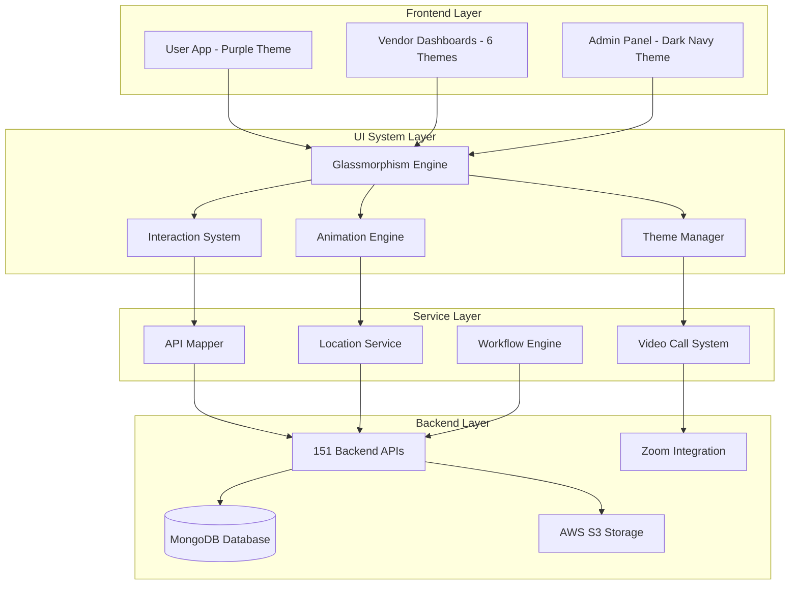

# Design Document: Futuristic Healthcare UI/UX System

## Overview

This design document outlines the comprehensive technical architecture for transforming the existing healthcare platform into a futuristic, premium Gen-Z UI/UX system. The system implements cutting-edge glassmorphism effects, role-based design systems, dynamic service theming, and advanced animation frameworks to create a billion-dollar startup experience across User App, Vendor Dashboards, and Admin Control Panel.

The design addresses critical existing issues including location detection failures, incomplete API integration, missing search functionality, and overflow errors while implementing a cohesive futuristic aesthetic that adapts dynamically based on healthcare services and user roles.

### Key Design Principles

1. **Futuristic Aesthetic**: Glassmorphism effects with layered gradients, floating UI panels, and soft shadows
2. **Role-Based Identity**: Distinct visual themes for each healthcare role (7 total themes)
3. **Dynamic Adaptation**: Service-based theming that changes UI context based on active healthcare service
4. **Performance Excellence**: 60fps animations with accessibility considerations
5. **Complete Integration**: 100% backend-frontend API mapping across 151 endpoints
6. **Responsive Design**: Pixel-perfect layouts across all device sizes

## Architecture

### System Architecture Overview

The futuristic healthcare UI/UX system follows a modular, service-oriented architecture with clear separation of concerns:



### Core System Components

#### 1. UI_System Architecture

The UI_System serves as the central orchestrator for all visual transformations:

**Glassmorphism Engine**
- Implements layered gradient effects with blur and transparency
- Manages floating UI panels with realistic depth and soft shadows
- Provides consistent glass-like visual effects across all interfaces
- Handles backdrop filters and visual hierarchy

**Animation Engine**
- Maintains 60fps performance across all animations
- Provides micro-interactions for every interactive element
- Implements contextual page transitions with appropriate easing curves
- Includes accessibility options for reduced motion

**Theme Manager**
- Orchestrates role-based theme switching
- Manages dynamic service-based theming
- Ensures smooth transitions between themes
- Maintains accessibility standards across all theme variations

**Interaction System**
- Provides tactile and responsive feedback for all user interactions
- Implements haptic feedback for mobile devices
- Manages dopamine-friendly micro-interactions
- Handles loading states and error feedback

#### 2. Location_Service Integration

Enhanced location detection system addressing current "null null" address issues:

**Components:**
- GPS-based location detection with fallback mechanisms
- Geocoding service integration for address resolution
- Manual address entry with autocomplete functionality
- Address validation and formatting system
- Location accuracy indicators

**Implementation:**
```dart
class LocationService {
  Future<LocationData> getCurrentLocation() async {
    // High-accuracy GPS detection
    // Geocoding with fallback to coordinate-based city detection
    // Address validation and formatting
    // Error handling with user-friendly messages
  }
  
  Future<List<Address>> searchAddresses(String query) async {
    // Autocomplete address search
    // Address validation
    // Formatted address return
  }
}
```

#### 3. Video_Call_System Workflow

Complete video consultation system with proper appointment management:

**Workflow Components:**
- Pre-call appointment validation
- Video call interface with quality indicators
- Prescription creation and sharing during consultations
- Post-call appointment completion workflow
- Recording capabilities (where legally permitted)

**Integration Points:**
- Zoom SDK integration for video calls
- Real-time communication for call status
- Document sharing for prescriptions
- Payment processing for consultations

#### 4. API_Mapper System

Comprehensive backend-frontend integration system:

**Features:**
- 100% mapping of all 151 backend APIs
- Standardized error handling and user feedback
- Loading state management for all operations
- Offline capability where appropriate
- Authentication and authorization handling

**Architecture:**
```dart
class APIMapper {
  // Centralized API client with error handling
  // Automatic token refresh
  // Request/response interceptors
  // Offline queue management
  // Loading state coordination
}
```

## Components and Interfaces

### Design System Framework

#### 1. User App - Purple Wellness Theme

**Primary Colors:**
- Primary Purple: `#667EEA` to `#764BA2` (gradient)
- Accent Purple: `#9C27B0`
- Background: `#0A0A0F` (dark futuristic)
- Glass Overlay: `rgba(255, 255, 255, 0.1)`

**Dynamic Service Adaptations:**
- Doctor Services: Blue accent overlay (`#2196F3`)
- Nurse Services: Soft blue overlay (`#03A9F4`)
- Emergency Services: Red accent overlay (`#FF6B6B`)
- Pharmacy Services: Teal overlay (`#00BCD4`)
- Lab Services: Purple-red overlay (`#E91E63`)
- Blood Bank: Ruby red overlay (`#C62828`)

**Component Structure:**
```dart
class UserAppTheme {
  static ThemeData get purpleWellnessTheme => ThemeData(
    // Glassmorphism color scheme
    // Dynamic service color overlays
    // Futuristic typography
    // Animation configurations
  );
}
```

#### 2. Vendor Dashboards - Role-Specific Themes

**Pharmacy Dashboard - Teal Theme:**
- Primary: `#00BCD4` to `#26C6DA`
- Secondary: `#00ACC1`
- Background: Dark teal gradient
- Glass effects with teal glow

**Doctor Dashboard - Blue Theme:**
- Primary: `#2196F3` to `#1976D2`
- Secondary: `#03A9F4`
- Background: Deep blue gradient
- Professional blue glass effects

**Nurse Dashboard - Soft Blue Theme:**
- Primary: `#03A9F4` to `#0288D1`
- Secondary: `#29B6F6`
- Background: Soft blue gradient
- Caring blue glass effects

**Pathology Dashboard - Purple/Red Theme:**
- Primary: `#9C27B0` to `#E91E63`
- Secondary: `#AD1457`
- Background: Purple-red gradient
- Scientific purple-red glass effects

**Ambulance Dashboard - Emergency Red Theme:**
- Primary: `#FF6B6B` to `#F44336`
- Secondary: `#E53935`
- Background: Emergency red gradient
- Urgent red glass effects

**Blood Bank Dashboard - Ruby Red Theme:**
- Primary: `#C62828` to `#B71C1C`
- Secondary: `#D32F2F`
- Background: Deep ruby gradient
- Life-saving ruby glass effects

#### 3. Admin Panel - Dark Navy Theme

**Color Scheme:**
- Primary: `#1A237E` (dark navy)
- Secondary: `#00E5FF` (electric blue)
- Background: `#0D1421` (deep space)
- Accent: `#64FFDA` (cyan glow)

**Design Elements:**
- High-contrast electric blue accents
- Command center aesthetic
- Advanced data visualization
- Professional control interface

### Glassmorphism Component Library

#### Core Glass Components

**GlassContainer:**
```dart
class GlassContainer extends StatelessWidget {
  final Widget child;
  final Color glowColor;
  final double blurIntensity;
  final BorderRadius borderRadius;
  
  @override
  Widget build(BuildContext context) {
    return ClipRRect(
      borderRadius: borderRadius,
      child: BackdropFilter(
        filter: ImageFilter.blur(sigmaX: blurIntensity, sigmaY: blurIntensity),
        child: Container(
          decoration: BoxDecoration(
            gradient: LinearGradient(
              colors: [
                Colors.white.withOpacity(0.1),
                Colors.white.withOpacity(0.05),
              ],
            ),
            borderRadius: borderRadius,
            border: Border.all(
              color: Colors.white.withOpacity(0.2),
              width: 1,
            ),
            boxShadow: [
              BoxShadow(
                color: glowColor.withOpacity(0.3),
                blurRadius: 20,
                spreadRadius: 2,
              ),
            ],
          ),
          child: child,
        ),
      ),
    );
  }
}
```

**FloatingPanel:**
```dart
class FloatingPanel extends StatelessWidget {
  final Widget child;
  final EdgeInsets padding;
  final Color shadowColor;
  
  @override
  Widget build(BuildContext context) {
    return Container(
      padding: padding,
      decoration: BoxDecoration(
        gradient: LinearGradient(
          begin: Alignment.topLeft,
          end: Alignment.bottomRight,
          colors: [
            Colors.white.withOpacity(0.15),
            Colors.white.withOpacity(0.05),
          ],
        ),
        borderRadius: BorderRadius.circular(20),
        boxShadow: [
          BoxShadow(
            color: shadowColor.withOpacity(0.2),
            blurRadius: 30,
            offset: const Offset(0, 10),
          ),
          BoxShadow(
            color: Colors.black.withOpacity(0.1),
            blurRadius: 10,
            offset: const Offset(0, 5),
          ),
        ],
      ),
      child: child,
    );
  }
}
```

#### Interactive Components

**FuturisticButton:**
```dart
class FuturisticButton extends StatefulWidget {
  final String text;
  final VoidCallback onPressed;
  final Color primaryColor;
  final Color glowColor;
  
  @override
  State<FuturisticButton> createState() => _FuturisticButtonState();
}

class _FuturisticButtonState extends State<FuturisticButton>
    with SingleTickerProviderStateMixin {
  late AnimationController _controller;
  late Animation<double> _scaleAnimation;
  late Animation<double> _glowAnimation;
  
  @override
  void initState() {
    super.initState();
    _controller = AnimationController(
      duration: const Duration(milliseconds: 200),
      vsync: this,
    );
    
    _scaleAnimation = Tween<double>(
      begin: 1.0,
      end: 0.95,
    ).animate(CurvedAnimation(
      parent: _controller,
      curve: Curves.easeInOut,
    ));
    
    _glowAnimation = Tween<double>(
      begin: 0.3,
      end: 0.8,
    ).animate(CurvedAnimation(
      parent: _controller,
      curve: Curves.easeInOut,
    ));
  }
  
  @override
  Widget build(BuildContext context) {
    return GestureDetector(
      onTapDown: (_) => _controller.forward(),
      onTapUp: (_) => _controller.reverse(),
      onTapCancel: () => _controller.reverse(),
      onTap: widget.onPressed,
      child: AnimatedBuilder(
        animation: _controller,
        builder: (context, child) {
          return Transform.scale(
            scale: _scaleAnimation.value,
            child: Container(
              padding: const EdgeInsets.symmetric(horizontal: 24, vertical: 16),
              decoration: BoxDecoration(
                gradient: LinearGradient(
                  colors: [
                    widget.primaryColor,
                    widget.primaryColor.withOpacity(0.8),
                  ],
                ),
                borderRadius: BorderRadius.circular(16),
                boxShadow: [
                  BoxShadow(
                    color: widget.glowColor.withOpacity(_glowAnimation.value),
                    blurRadius: 20,
                    spreadRadius: 2,
                  ),
                ],
              ),
              child: Text(
                widget.text,
                style: const TextStyle(
                  color: Colors.white,
                  fontSize: 16,
                  fontWeight: FontWeight.w600,
                ),
              ),
            ),
          );
        },
      ),
    );
  }
}
```

### Animation System Architecture

#### Micro-Interaction Framework

**Interaction Types:**
1. **Tap Interactions**: Scale and glow animations
2. **Hover Effects**: Elevation and color transitions
3. **Loading States**: Shimmer and pulse animations
4. **Page Transitions**: Slide and fade combinations
5. **Service Switching**: Theme transition animations

**Performance Optimization:**
- Hardware acceleration for all animations
- Efficient animation disposal
- Frame rate monitoring
- Memory usage optimization

#### Animation Configuration

```dart
class AnimationConfig {
  // Standard durations
  static const Duration fastAnimation = Duration(milliseconds: 150);
  static const Duration normalAnimation = Duration(milliseconds: 300);
  static const Duration slowAnimation = Duration(milliseconds: 500);
  
  // Easing curves
  static const Curve defaultCurve = Curves.easeInOut;
  static const Curve bounceCurve = Curves.elasticOut;
  static const Curve smoothCurve = Curves.decelerate;
  
  // Performance settings
  static const int targetFPS = 60;
  static const bool enableHapticFeedback = true;
}
```

## Data Models

### Theme System Models

#### ThemeConfiguration

```dart
class ThemeConfiguration {
  final String themeId;
  final String themeName;
  final UserRole userRole;
  final ColorScheme colorScheme;
  final GlassmorphismConfig glassmorphism;
  final AnimationConfig animations;
  final ServiceThemeOverrides serviceOverrides;
  
  const ThemeConfiguration({
    required this.themeId,
    required this.themeName,
    required this.userRole,
    required this.colorScheme,
    required this.glassmorphism,
    required this.animations,
    required this.serviceOverrides,
  });
}

enum UserRole {
  patient,
  doctor,
  nurse,
  pharmacist,
  ambulanceDriver,
  bloodBankOperator,
  pathologyTechnician,
  admin,
}
```

#### ServiceThemeOverride

```dart
class ServiceThemeOverride {
  final HealthcareService service;
  final Color primaryOverride;
  final Color accentOverride;
  final Color glowOverride;
  final IconData serviceIcon;
  final String serviceDisplayName;
  
  const ServiceThemeOverride({
    required this.service,
    required this.primaryOverride,
    required this.accentOverride,
    required this.glowOverride,
    required this.serviceIcon,
    required this.serviceDisplayName,
  });
}

enum HealthcareService {
  doctor,
  nurse,
  pathology,
  ambulance,
  bloodBank,
  pharmacy,
  emergency,
}
```

### Location System Models

#### LocationData

```dart
class LocationData {
  final double latitude;
  final double longitude;
  final String formattedAddress;
  final String city;
  final String state;
  final String country;
  final String postalCode;
  final LocationAccuracy accuracy;
  final DateTime timestamp;
  
  const LocationData({
    required this.latitude,
    required this.longitude,
    required this.formattedAddress,
    required this.city,
    required this.state,
    required this.country,
    required this.postalCode,
    required this.accuracy,
    required this.timestamp,
  });
  
  factory LocationData.fromJson(Map<String, dynamic> json) {
    return LocationData(
      latitude: json['latitude']?.toDouble() ?? 0.0,
      longitude: json['longitude']?.toDouble() ?? 0.0,
      formattedAddress: json['formattedAddress'] ?? '',
      city: json['city'] ?? '',
      state: json['state'] ?? '',
      country: json['country'] ?? 'India',
      postalCode: json['postalCode'] ?? '',
      accuracy: LocationAccuracy.values.firstWhere(
        (e) => e.toString() == json['accuracy'],
        orElse: () => LocationAccuracy.medium,
      ),
      timestamp: DateTime.parse(json['timestamp'] ?? DateTime.now().toIso8601String()),
    );
  }
}

enum LocationAccuracy {
  high,
  medium,
  low,
  unavailable,
}
```

### Video Call System Models

#### VideoCallSession

```dart
class VideoCallSession {
  final String sessionId;
  final String bookingId;
  final String roomId;
  final String accessToken;
  final VideoCallStatus status;
  final DateTime scheduledTime;
  final DateTime? startTime;
  final DateTime? endTime;
  final List<VideoCallParticipant> participants;
  final VideoCallSettings settings;
  final PrescriptionData? prescription;
  
  const VideoCallSession({
    required this.sessionId,
    required this.bookingId,
    required this.roomId,
    required this.accessToken,
    required this.status,
    required this.scheduledTime,
    this.startTime,
    this.endTime,
    required this.participants,
    required this.settings,
    this.prescription,
  });
}

enum VideoCallStatus {
  scheduled,
  waiting,
  inProgress,
  completed,
  cancelled,
  failed,
}

class VideoCallParticipant {
  final String userId;
  final String name;
  final UserRole role;
  final bool isHost;
  final bool isMuted;
  final bool isVideoEnabled;
  final DateTime joinTime;
  
  const VideoCallParticipant({
    required this.userId,
    required this.name,
    required this.role,
    required this.isHost,
    required this.isMuted,
    required this.isVideoEnabled,
    required this.joinTime,
  });
}
```

### API Integration Models

#### APIResponse

```dart
class APIResponse<T> {
  final bool success;
  final T? data;
  final String? message;
  final String? errorCode;
  final Map<String, dynamic>? metadata;
  final DateTime timestamp;
  
  const APIResponse({
    required this.success,
    this.data,
    this.message,
    this.errorCode,
    this.metadata,
    required this.timestamp,
  });
  
  factory APIResponse.success(T data, {String? message}) {
    return APIResponse<T>(
      success: true,
      data: data,
      message: message,
      timestamp: DateTime.now(),
    );
  }
  
  factory APIResponse.error(String message, {String? errorCode}) {
    return APIResponse<T>(
      success: false,
      message: message,
      errorCode: errorCode,
      timestamp: DateTime.now(),
    );
  }
}
```

#### LoadingState

```dart
enum LoadingState {
  idle,
  loading,
  success,
  error,
  refreshing,
}

class UIState<T> {
  final LoadingState loadingState;
  final T? data;
  final String? errorMessage;
  final bool hasMore;
  final int currentPage;
  
  const UIState({
    required this.loadingState,
    this.data,
    this.errorMessage,
    this.hasMore = false,
    this.currentPage = 1,
  });
  
  UIState<T> copyWith({
    LoadingState? loadingState,
    T? data,
    String? errorMessage,
    bool? hasMore,
    int? currentPage,
  }) {
    return UIState<T>(
      loadingState: loadingState ?? this.loadingState,
      data: data ?? this.data,
      errorMessage: errorMessage ?? this.errorMessage,
      hasMore: hasMore ?? this.hasMore,
      currentPage: currentPage ?? this.currentPage,
    );
  }
}
```

## Correctness Properties

*A property is a characteristic or behavior that should hold true across all valid executions of a system-essentially, a formal statement about what the system should do. Properties serve as the bridge between human-readable specifications and machine-verifiable correctness guarantees.*

After analyzing all acceptance criteria, I've identified properties that can be combined to eliminate redundancy while maintaining comprehensive coverage. Several properties about performance (11.2 and 4.6), accessibility (12.3 and 4.7), and theming (multiple theme-related properties) have been consolidated into more comprehensive properties.

### Property 1: Glassmorphism Visual Effects Implementation

*For any* UI interface in the system, all glassmorphism components should have the required visual properties including blur effects, layered gradients, transparency, floating panels with soft shadows, and realistic depth effects.

**Validates: Requirements 1.1, 1.2**

### Property 2: Animation Performance and Accessibility

*For any* animation or transition in the system, it should maintain 60fps performance, include accessibility options for reduced motion, and provide appropriate micro-interactions for all interactive elements.

**Validates: Requirements 4.1, 4.6, 4.7, 11.2, 12.3**

### Property 3: Content Structure Preservation During Animations

*For any* UI element with animations, after the animation completes, the content structure should remain intact and accessible without layout disruption.

**Validates: Requirements 1.3**

### Property 4: Universal Interactive Feedback

*For any* interactive element in the system, user interactions should provide appropriate tactile, visual, or haptic feedback including micro-interactions and responsive animations.

**Validates: Requirements 1.4, 4.5**

### Property 5: Role-Based Theme Implementation

*For any* user role in the system, the interface should implement the correct theme (purple wellness for patients, 6 distinct vendor themes, dark navy for admin) with proper color schemes and visual differentiation.

**Validates: Requirements 2.1, 2.2, 2.3, 2.5**

### Property 6: Dynamic Theme Switching

*For any* role or service change, the Theme_Manager should instantly adapt the interface with smooth transitions and real-time theme switching without requiring app restarts.

**Validates: Requirements 2.4, 3.2, 3.5**

### Property 7: Service-Based Theme Adaptation

*For any* healthcare service accessed by a patient, the UI colors, icons, and visual elements should adapt to match the service theme while maintaining accessibility standards and user familiarity.

**Validates: Requirements 3.1, 3.3, 3.4**

### Property 8: Contextual Animation System

*For any* user navigation or interaction, the system should provide contextual transition animations, smooth page transitions with appropriate easing curves, and engaging loading animations.

**Validates: Requirements 4.2, 4.3, 4.4**

### Property 9: Location Service Accuracy and Fallback

*For any* location detection attempt, the system should display properly formatted addresses (not "null null"), provide manual entry with autocomplete when detection fails, and show location accuracy indicators.

**Validates: Requirements 5.1, 5.3, 5.6**

### Property 10: Location Data Consistency and Persistence

*For any* location-related operation, addresses should be validated and formatted consistently across all interfaces, be visible during time selection, and be stored for future retrieval.

**Validates: Requirements 5.2, 5.4, 5.5**

### Property 11: Video Call Workflow Management

*For any* video consultation, the system should prevent appointment completion before call start, provide clear interface controls during calls, integrate prescription functionality, and guide proper completion workflow.

**Validates: Requirements 6.1, 6.2, 6.3, 6.4**

### Property 12: Video Call Quality and Recording

*For any* active video call, the system should maintain call quality indicators, connection status monitoring, and provide recording capabilities where legally permitted and consented.

**Validates: Requirements 6.5, 6.6**

### Property 13: Complete API Integration Coverage

*For any* of the 151 backend APIs, there should be corresponding frontend implementation with proper error handling, loading states, and user feedback.

**Validates: Requirements 7.1, 7.2, 7.3**

### Property 14: API Security and Data Consistency

*For any* API operation, the system should implement proper authentication and authorization, maintain data consistency across interfaces, and provide offline capability where appropriate.

**Validates: Requirements 7.4, 7.5, 7.6**

### Property 15: Comprehensive Search Functionality

*For any* search operation, the system should provide functional search bars, real-time suggestions, global search across all services, filters and sorting options, search history, and voice search where supported.

**Validates: Requirements 8.1, 8.2, 8.3, 8.4, 8.5, 8.6**

### Property 16: Vendor Dashboard Functionality

*For any* vendor using the dashboard, functional help buttons, real-time availability changes, help documentation, and tutorial overlays should be available and working correctly.

**Validates: Requirements 9.1, 9.2, 9.4, 9.5**

### Property 17: Real-Time Interface Updates

*For any* data change (like vendor availability updates), the changes should be reflected immediately across all relevant interfaces without requiring manual refresh.

**Validates: Requirements 9.3**

### Property 18: Responsive Layout and Overflow Management

*For any* screen size or device, the UI should eliminate overflow errors, provide responsive layouts, implement proper scrolling or truncation for oversized content, and maintain visual hierarchy and readability.

**Validates: Requirements 10.1, 10.2, 10.3, 10.4**

### Property 19: Consistent Design and Touch Targets

*For any* UI component, spacing and alignment should be consistent across the system, and touch targets should meet minimum size requirements for mobile interfaces.

**Validates: Requirements 10.5, 10.6**

### Property 20: Performance Optimization

*For any* screen or operation, initial screens should load within 2 seconds, implement lazy loading for non-critical content, provide progressive loading indicators, optimize memory usage, and implement efficient caching.

**Validates: Requirements 11.1, 11.3, 11.4, 11.5, 11.6**

### Property 21: Accessibility Compliance

*For any* interface element, the system should maintain WCAG 2.1 AA compliance, provide screen reader compatibility, maintain sufficient color contrast ratios, support keyboard navigation, and include voice control where supported.

**Validates: Requirements 12.1, 12.2, 12.4, 12.5, 12.6**

### Property 22: Security Implementation

*For any* user interaction involving data, the system should implement secure data transmission, provide privacy indicators, require additional confirmations for sensitive medical data, support biometric authentication where available, and implement automatic session timeout.

**Validates: Requirements 13.1, 13.2, 13.3, 13.4, 13.5**

### Property 23: Privacy Control Features

*For any* user account, the system should provide data export and deletion options for privacy control.

**Validates: Requirements 13.6**

### Property 24: Cross-Platform Consistency

*For any* feature or functionality, it should work identically across iOS, Android, and web platforms with synchronized user data, session continuity where appropriate, and platform-specific interaction adaptations.

**Validates: Requirements 14.1, 14.2, 14.3, 14.4**

### Property 25: Cloud Backup and Synchronization

*For any* user settings and preferences, they should be backed up to cloud storage and synchronized across devices.

**Validates: Requirements 14.5**

### Property 26: Real-Time Communication System

*For any* real-time event (notifications, status updates, emergency situations, chat messages), the system should provide appropriate visual and audio cues, live status updates, priority handling for emergencies, and notification customization options.

**Validates: Requirements 15.1, 15.2, 15.3, 15.4, 15.5**

### Property 27: Rich Push Notification Support

*For any* push notification, the system should support rich media content including images and interactive elements.

**Validates: Requirements 15.6**

## Error Handling

### Error Handling Strategy

The futuristic healthcare UI/UX system implements a comprehensive error handling strategy that maintains the premium user experience while providing clear, actionable feedback:

#### 1. Visual Error Feedback

**Glassmorphism Error States:**
- Error containers use red-tinted glass effects with appropriate glow
- Maintain visual consistency with the futuristic design language
- Animated error state transitions to avoid jarring user experience

**Error Component Design:**
```dart
class FuturisticErrorContainer extends StatelessWidget {
  final String errorMessage;
  final VoidCallback? onRetry;
  final ErrorSeverity severity;
  
  @override
  Widget build(BuildContext context) {
    return GlassContainer(
      glowColor: _getErrorColor(severity),
      child: Column(
        children: [
          Icon(_getErrorIcon(severity), color: Colors.white),
          Text(errorMessage, style: futuristicErrorTextStyle),
          if (onRetry != null) FuturisticButton(
            text: 'Retry',
            onPressed: onRetry!,
            primaryColor: _getErrorColor(severity),
          ),
        ],
      ),
    );
  }
}

enum ErrorSeverity {
  info,     // Blue glow
  warning,  // Orange glow  
  error,    // Red glow
  critical, // Pulsing red glow
}
```

#### 2. API Error Handling

**Centralized Error Management:**
```dart
class APIErrorHandler {
  static APIResponse<T> handleError<T>(dynamic error) {
    if (error is DioError) {
      switch (error.response?.statusCode) {
        case 401:
          return APIResponse.error(
            'Session expired. Please login again.',
            errorCode: 'AUTH_EXPIRED',
          );
        case 403:
          return APIResponse.error(
            'Access denied. Please check your permissions.',
            errorCode: 'ACCESS_DENIED',
          );
        case 404:
          return APIResponse.error(
            'Service not found. Please try again later.',
            errorCode: 'SERVICE_NOT_FOUND',
          );
        case 500:
          return APIResponse.error(
            'Server error. Our team has been notified.',
            errorCode: 'SERVER_ERROR',
          );
        default:
          return APIResponse.error(
            'Network error. Please check your connection.',
            errorCode: 'NETWORK_ERROR',
          );
      }
    }
    
    return APIResponse.error(
      'An unexpected error occurred. Please try again.',
      errorCode: 'UNKNOWN_ERROR',
    );
  }
}
```

**Retry Mechanisms:**
- Exponential backoff for network errors
- Automatic retry for transient failures
- User-initiated retry for persistent errors
- Offline queue for failed requests

#### 3. Location Service Error Handling

**Location Error States:**
```dart
class LocationErrorHandler {
  static LocationErrorState handleLocationError(LocationException error) {
    switch (error.type) {
      case LocationErrorType.permissionDenied:
        return LocationErrorState(
          message: 'Location access required for personalized services',
          action: LocationErrorAction.requestPermission,
          fallback: LocationErrorAction.manualEntry,
        );
      
      case LocationErrorType.serviceDisabled:
        return LocationErrorState(
          message: 'Please enable location services',
          action: LocationErrorAction.openSettings,
          fallback: LocationErrorAction.manualEntry,
        );
      
      case LocationErrorType.timeout:
        return LocationErrorState(
          message: 'Location detection timed out',
          action: LocationErrorAction.retry,
          fallback: LocationErrorAction.manualEntry,
        );
      
      default:
        return LocationErrorState(
          message: 'Unable to detect location',
          action: LocationErrorAction.manualEntry,
          fallback: null,
        );
    }
  }
}
```

#### 4. Video Call Error Handling

**Video Call Error Management:**
- Connection quality monitoring with automatic quality adjustment
- Fallback to audio-only mode for poor connections
- Automatic reconnection attempts with user notification
- Clear error messages for camera/microphone permissions

#### 5. Animation Error Handling

**Performance Degradation Handling:**
- Frame rate monitoring with automatic animation reduction
- Graceful degradation for low-performance devices
- Fallback to static states when animations fail
- Memory pressure detection with animation suspension

#### 6. Theme System Error Handling

**Theme Loading Failures:**
- Fallback to default theme when custom themes fail to load
- Graceful handling of missing theme assets
- Error recovery for corrupted theme configurations
- Automatic theme validation before application

## Testing Strategy

### Dual Testing Approach

The futuristic healthcare UI/UX system employs a comprehensive dual testing approach combining unit tests for specific scenarios and property-based tests for universal behaviors:

#### Unit Testing Strategy

**Focus Areas for Unit Tests:**
1. **Specific UI Component Behavior**: Individual glassmorphism components, animation triggers, theme switching
2. **Integration Points**: API client integration, location service integration, video call SDK integration
3. **Edge Cases**: Network failures, permission denials, device capability limitations
4. **Error Conditions**: API errors, location detection failures, video call connection issues

**Unit Test Examples:**
```dart
// Theme switching unit test
testWidgets('should switch to doctor theme when doctor service selected', (tester) async {
  await tester.pumpWidget(TestApp());
  
  // Select doctor service
  await tester.tap(find.byKey(Key('doctor_service')));
  await tester.pumpAndSettle();
  
  // Verify theme change
  final themeData = Theme.of(tester.element(find.byType(MaterialApp)));
  expect(themeData.primaryColor, equals(DoctorTheme.primaryColor));
});

// Location service unit test
test('should format address correctly when location detected', () async {
  final locationService = LocationService();
  final mockPosition = Position(latitude: 19.0760, longitude: 72.8777);
  
  final result = await locationService.formatAddress(mockPosition);
  
  expect(result.city, isNotEmpty);
  expect(result.formattedAddress, isNot(contains('null')));
});
```

#### Property-Based Testing Strategy

**Property-Based Testing Library**: Using `test` package with custom property generators for Flutter

**Property Test Configuration:**
- Minimum 100 iterations per property test
- Custom generators for UI states, user roles, and healthcare services
- Comprehensive input coverage through randomization

**Property Test Implementation Examples:**

```dart
// Property test for glassmorphism effects
test('Property 1: Glassmorphism Visual Effects Implementation', () {
  // Feature: futuristic-healthcare-ui-system, Property 1: For any UI interface in the system, all glassmorphism components should have the required visual properties including blur effects, layered gradients, transparency, floating panels with soft shadows, and realistic depth effects.
  
  final generator = InterfaceGenerator();
  
  for (int i = 0; i < 100; i++) {
    final interface = generator.generateRandomInterface();
    final glassmorphismComponents = interface.getGlassmorphismComponents();
    
    for (final component in glassmorphismComponents) {
      expect(component.hasBlurEffect, isTrue);
      expect(component.hasLayeredGradients, isTrue);
      expect(component.hasTransparency, isTrue);
      expect(component.hasSoftShadows, isTrue);
      expect(component.hasRealisticDepth, isTrue);
    }
  }
});

// Property test for theme consistency
test('Property 5: Role-Based Theme Implementation', () {
  // Feature: futuristic-healthcare-ui-system, Property 5: For any user role in the system, the interface should implement the correct theme with proper color schemes and visual differentiation.
  
  final roleGenerator = UserRoleGenerator();
  
  for (int i = 0; i < 100; i++) {
    final role = roleGenerator.generateRandomRole();
    final theme = ThemeManager.getThemeForRole(role);
    
    switch (role) {
      case UserRole.patient:
        expect(theme.primaryColor, equals(PurpleWellnessTheme.primaryColor));
        break;
      case UserRole.doctor:
        expect(theme.primaryColor, equals(DoctorTheme.primaryColor));
        break;
      case UserRole.admin:
        expect(theme.primaryColor, equals(AdminTheme.darkNavyColor));
        break;
      // ... other roles
    }
    
    expect(theme.isVisuallyDistinct, isTrue);
  }
});

// Property test for animation performance
test('Property 2: Animation Performance and Accessibility', () {
  // Feature: futuristic-healthcare-ui-system, Property 2: For any animation or transition in the system, it should maintain 60fps performance, include accessibility options for reduced motion, and provide appropriate micro-interactions for all interactive elements.
  
  final animationGenerator = AnimationGenerator();
  
  for (int i = 0; i < 100; i++) {
    final animation = animationGenerator.generateRandomAnimation();
    
    expect(animation.targetFPS, equals(60));
    expect(animation.hasReducedMotionOption, isTrue);
    expect(animation.hasMicroInteractions, isTrue);
    expect(animation.isAccessible, isTrue);
  }
});
```

#### Integration Testing

**End-to-End Workflow Testing:**
1. **Complete User Journeys**: Patient booking flow, doctor consultation workflow, admin management tasks
2. **Cross-Platform Testing**: iOS, Android, and web platform consistency
3. **Real-Time Feature Testing**: Video calls, notifications, live updates
4. **Performance Testing**: Load times, animation smoothness, memory usage

#### Accessibility Testing

**Automated Accessibility Testing:**
- Screen reader compatibility testing
- Color contrast ratio validation
- Keyboard navigation testing
- Touch target size verification

**Manual Accessibility Testing:**
- Real device testing with assistive technologies
- User testing with accessibility needs
- Expert accessibility review

#### Performance Testing

**Animation Performance Testing:**
- Frame rate monitoring during animations
- Memory usage tracking
- Battery usage optimization testing
- Performance on low-end devices

**Load Performance Testing:**
- Initial screen load time measurement
- API response time testing
- Image loading optimization testing
- Caching effectiveness testing

#### Security Testing

**Security Validation:**
- Authentication flow testing
- Data encryption verification
- Session management testing
- Privacy control functionality testing

### Testing Tools and Frameworks

**Primary Testing Stack:**
- **Flutter Test**: Widget and unit testing
- **Integration Test**: End-to-end testing
- **Mockito**: API mocking and dependency injection
- **Golden Toolkit**: Visual regression testing
- **Custom Property Generators**: For property-based testing

**Performance Testing Tools:**
- **Flutter Performance**: Frame rate monitoring
- **DevTools**: Memory and performance profiling
- **Firebase Performance**: Real-world performance monitoring

**Accessibility Testing Tools:**
- **Flutter Accessibility**: Built-in accessibility testing
- **Accessibility Scanner**: Android accessibility testing
- **VoiceOver/TalkBack**: Screen reader testing

### Continuous Integration Testing

**Automated Testing Pipeline:**
1. **Unit Tests**: Run on every commit
2. **Integration Tests**: Run on pull requests
3. **Property Tests**: Run nightly with extended iterations
4. **Performance Tests**: Run weekly with performance benchmarks
5. **Accessibility Tests**: Run on release candidates

**Quality Gates:**
- 90% code coverage requirement
- All property tests must pass
- Performance benchmarks must be met
- Accessibility compliance verification
- Visual regression test approval